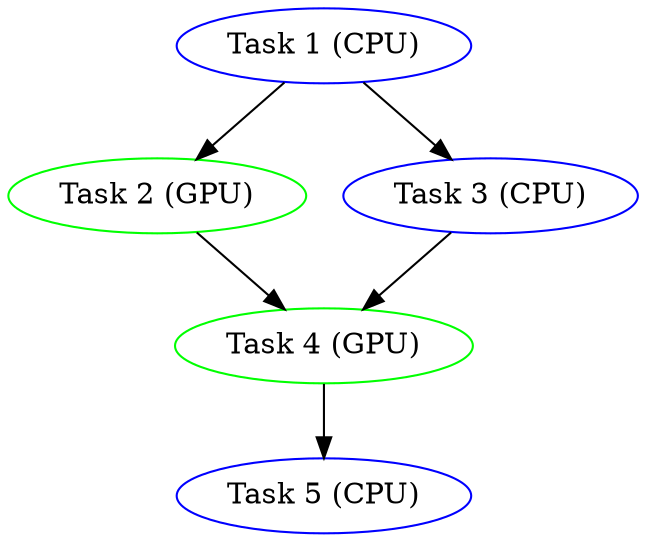

# Examples Walkthrough

> Detailed explanations of all HTS example programs

---

## Table of Contents

- [Overview](#overview)
- [Simple DAG](#simple-dag)
- [Parallel Pipeline](#parallel-pipeline)
- [Fluent API](#fluent-api)
- [Task Groups](#task-groups)
- [GPU Computation](#gpu-computation)
- [Error Handling](#error-handling)
- [Profiling](#profiling)
- [Scheduling Policies](#scheduling-policies)
- [Graph Visualization](#graph-visualization)
- [Advanced Features](#advanced-features)

---

## Overview

HTS includes 10 example programs demonstrating various features. Each example is a complete, compilable program.

### Building Examples

```bash
cd build
cmake .. -DCMAKE_BUILD_TYPE=Release
make -j$(nproc)

# Run examples
./simple_dag
./parallel_pipeline
./fluent_api
# ... etc
```

---

## Simple DAG

**File**: `examples/simple_dag.cpp`

**Concepts**: Basic task graph construction, dependencies

### Description

Demonstrates the simplest task dependency graph: a → b → c where each task depends on the previous one.

### Key Code

```cpp
// Create three tasks
auto task_a = scheduler.graph().add_task(DeviceType::CPU);
auto task_b = scheduler.graph().add_task(DeviceType::CPU);
auto task_c = scheduler.graph().add_task(DeviceType::CPU);

// Set functions
task_a->set_cpu_function([](TaskContext& ctx) {
    std::cout << "Task A\n";
});

task_b->set_cpu_function([](TaskContext& ctx) {
    std::cout << "Task B\n";
});

task_c->set_cpu_function([](TaskContext& ctx) {
    std::cout << "Task C\n";
});

// Define dependencies: a → b → c
scheduler.graph().add_dependency(task_a->id(), task_b->id());
scheduler.graph().add_dependency(task_b->id(), task_c->id());

// Execute
scheduler.execute();
```

### Output

```
Task A
Task B
Task C
```

### What to Learn

1. Creating tasks with `add_task()`
2. Setting CPU functions with lambdas
3. Adding dependencies with `add_dependency()`
4. Execution order is topological, not creation order

---

## Parallel Pipeline

**File**: `examples/parallel_pipeline.cpp`

**Concepts**: Parallel stages, data flow, pipeline pattern

### Description

A classic pipeline with parallel stages: multiple items flow through Load → Process → Save stages concurrently.

### Architecture

```
Item 1:  [Load] → [Process] → [Save]
Item 2:  [Load] → [Process] → [Save]
Item 3:  [Load] → [Process] → [Save]
         
Time →   Parallel execution across items
```

### Key Code

```cpp
constexpr int NUM_ITEMS = 4;

for (int i = 0; i < NUM_ITEMS; ++i) {
    auto load = scheduler.graph().add_task(DeviceType::CPU);
    auto process = scheduler.graph().add_task(DeviceType::CPU);
    auto save = scheduler.graph().add_task(DeviceType::CPU);
    
    // Set task functions with item ID
    load->set_cpu_function([i](TaskContext& ctx) {
        std::cout << "Loading item " << i << "\n";
    });
    
    process->set_cpu_function([i](TaskContext& ctx) {
        std::cout << "Processing item " << i << "\n";
    });
    
    save->set_cpu_function([i](TaskContext& ctx) {
        std::cout << "Saving item " << i << "\n";
    });
    
    // Chain dependencies for this item
    scheduler.graph().add_dependency(load->id(), process->id());
    scheduler.graph().add_dependency(process->id(), save->id());
}
```

### What to Learn

1. Multiple independent pipelines running in parallel
2. Each pipeline maintains internal ordering
3. Different pipelines execute concurrently

---

## Fluent API

**File**: `examples/fluent_api.cpp`

**Concepts**: TaskBuilder, method chaining, readable code

### Description

Demonstrates the fluent TaskBuilder API for more readable task construction.

### Comparison

```cpp
// Traditional API
auto task = scheduler.graph().add_task(DeviceType::CPU);
task->set_name("Process");
task->set_priority(TaskPriority::High);
task->set_cpu_function([](TaskContext& ctx) { /* ... */ });

// Fluent API
auto task = TaskBuilder(scheduler.graph())
    .name("Process")
    .priority(TaskPriority::High)
    .cpu([](TaskContext& ctx) { /* ... */ })
    .build();
```

### Key Code

```cpp
TaskBuilder builder(scheduler.graph());

// Build a simple chain
auto init = builder
    .name("Initialize")
    .device(DeviceType::CPU)
    .cpu([](TaskContext& ctx) {
        std::cout << "Initializing...\n";
        ctx.set_output("config", std::string("ready"));
    })
    .build();

auto validate = builder
    .name("Validate")
    .after(init)
    .device(DeviceType::CPU)
    .cpu([](TaskContext& ctx) {
        auto config = ctx.get_input<std::string>("config");
        std::cout << "Validating: " << config << "\n";
    })
    .build();

auto process = builder
    .name("Process")
    .after(validate)
    .device(DeviceType::Any)
    .cpu([](TaskContext& ctx) {
        std::cout << "Processing (CPU)\n";
    })
    .gpu([](TaskContext& ctx, cudaStream_t stream) {
        std::cout << "Processing (GPU)\n";
    })
    .build();
```

### What to Learn

1. Method chaining for readable code
2. `.after()` for declaring dependencies
3. `.cpu()` and `.gpu()` for dual implementations

---

## Task Groups

**File**: `examples/task_groups.cpp`

**Concepts**: TaskGroup, batch operations, worker patterns

### Description

Shows how to manage groups of related tasks with shared dependencies.

### Key Code

```cpp
// Create a "worker pool" task group
TaskGroup workers("DataWorkers", scheduler.graph());

// Add multiple worker tasks
for (int i = 0; i < 4; ++i) {
    auto task = workers.add_task(DeviceType::CPU);
    task->set_cpu_function([i](TaskContext& ctx) {
        std::cout << "Worker " << i << " processing\n";
        std::this_thread::sleep_for(std::chrono::milliseconds(100));
    });
}

// Set priority for all workers
workers.set_priority(TaskPriority::Normal);

// All workers depend on initialization
auto init = scheduler.graph().add_task(DeviceType::CPU);
init->set_cpu_function([](TaskContext& ctx) {
    std::cout << "Initialization complete\n";
});
workers.depends_on(init);

// Cleanup depends on all workers completing
auto cleanup = scheduler.graph().add_task(DeviceType::CPU);
cleanup->set_cpu_function([](TaskContext& ctx) {
    std::cout << "Cleanup\n";
});
workers.then(cleanup);
```

### What to Learn

1. Task groups for batch management
2. `depends_on()` for group-level dependencies
3. `then()` for dependents waiting on the whole group

---

## GPU Computation

**File**: `examples/gpu_computation.cu`

**Concepts**: CUDA kernels, CPU/GPU workflow, memory management

### Description

Complete CPU preprocessing → GPU computation → CPU postprocessing workflow.

### Key Code

```cpp
// Simple CUDA kernel
__global__ void multiply_kernel(float* data, float factor, int n) {
    int idx = blockIdx.x * blockDim.x + threadIdx.x;
    if (idx < n) {
        data[idx] *= factor;
    }
}

// CPU: Allocate and initialize
auto preprocess = scheduler.graph().add_task(DeviceType::CPU);
preprocess->set_cpu_function([](TaskContext& ctx) {
    const size_t size = 1024 * sizeof(float);
    void* d_data = ctx.allocate_gpu_memory(size);
    
    // Initialize with ones
    std::vector<float> host_data(1024, 1.0f);
    cudaMemcpy(d_data, host_data.data(), size, cudaMemcpyHostToDevice);
    
    ctx.set_output("data", d_data, size);
});

// GPU: Compute
auto compute = scheduler.graph().add_task(DeviceType::GPU);
compute->set_gpu_function([](TaskContext& ctx, cudaStream_t stream) {
    auto d_data = ctx.get_input<void*>("data");
    
    int block_size = 256;
    int grid_size = (1024 + block_size - 1) / block_size;
    
    multiply_kernel<<<grid_size, block_size, 0, stream>>>(
        static_cast<float*>(d_data), 2.0f, 1024);
    
    ctx.set_output("result", d_data, 1024 * sizeof(float));
});

// CPU: Verify
auto postprocess = scheduler.graph().add_task(DeviceType::CPU);
postprocess->set_cpu_function([](TaskContext& ctx) {
    auto d_result = ctx.get_input<void*>("result");
    
    std::vector<float> host_result(1024);
    cudaMemcpy(host_result.data(), d_result, 
               1024 * sizeof(float), cudaMemcpyDeviceToHost);
    
    float sum = std::accumulate(host_result.begin(), 
                                host_result.end(), 0.0f);
    std::cout << "Sum (expected 2048): " << sum << "\n";
});

// Chain dependencies
scheduler.graph().add_dependency(preprocess->id(), compute->id());
scheduler.graph().add_dependency(compute->id(), postprocess->id());
```

### What to Learn

1. CUDA kernel launches from task functions
2. Using `cudaStream_t` for async execution
3. Data flow through TaskContext
4. CPU/GPU memory transfers

---

## Error Handling

**File**: `examples/error_handling.cpp`

**Concepts**: Error callbacks, retry policies, failure propagation

### Description

Demonstrates various error handling patterns.

### Key Code

```cpp
// Set global error callback
scheduler.set_error_callback([](TaskId id, const std::string& msg) {
    std::cerr << "[ERROR] Task " << id << " failed: " << msg << "\n";
});

// Task with retry policy
auto risky_task = scheduler.graph().add_task(DeviceType::CPU);
risky_task->set_cpu_function([](TaskContext& ctx) {
    static thread_local std::mt19937 gen(std::random_device{}());
    std::uniform_int_distribution<> dis(0, 3);
    
    // 25% chance of failure
    if (dis(gen) == 0) {
        throw std::runtime_error("Random failure");
    }
    std::cout << "Risky task succeeded\n";
});

// Retry up to 3 times with exponential backoff
risky_task->set_retry_policy(
    RetryPolicyFactory::exponential(3, std::chrono::milliseconds{100})
);

// Dependent task (will be cancelled if risky fails)
auto dependent = scheduler.graph().add_task(DeviceType::CPU);
dependent->set_cpu_function([](TaskContext& ctx) {
    std::cout << "Dependent task executed\n";
});
scheduler.graph().add_dependency(risky_task->id(), dependent->id());
```

### What to Learn

1. Global error callbacks
2. Per-task retry policies
3. Automatic cancellation of dependents

---

## Profiling

**File**: `examples/profiling.cpp`

**Concepts**: Profiling, performance metrics, timeline export

### Description

Shows how to enable profiling and interpret results.

### Key Code

```cpp
// Enable profiling
scheduler.set_profiling(true);

// Build and execute task graph
// ...

scheduler.execute();

// Get profiling data
auto summary = scheduler.profiler().generate_summary();

std::cout << "Execution Summary:\n"
          << "  Total time: " << summary.total_time.count() / 1e6 << " ms\n"
          << "  CPU tasks: " << summary.cpu_task_count << "\n"
          << "  GPU tasks: " << summary.gpu_task_count << "\n"
          << "  Parallelism: " << summary.parallelism << "x\n";

// Export timeline for Chrome tracing
scheduler.profiler().export_timeline("timeline.json");
std::cout << "Timeline exported to timeline.json\n";
std::cout << "Open chrome://tracing and load the file\n";
```

### What to Learn

1. Enabling profiling with `set_profiling(true)`
2. Interpreting summary statistics
3. Exporting Chrome trace format

---

## Scheduling Policies

**File**: `examples/scheduling_policies.cpp`

**Concepts**: Different policies, policy comparison

### Description

Compares different scheduling policies on the same workload.

### Key Code

```cpp
// Workload: mix of CPU-friendly and GPU-friendly tasks
auto create_workload = [](Scheduler& sched) {
    for (int i = 0; i < 10; ++i) {
        auto t = sched.graph().add_task(DeviceType::Any);
        t->set_cpu_function([](TaskContext& ctx) {
            // CPU-friendly task
            volatile long sum = 0;
            for (long j = 0; j < 1000000; ++j) sum += j;
        });
        t->set_gpu_function([](TaskContext& ctx, cudaStream_t s) {
            // GPU-friendly task
            // Launch simple kernel
        });
    }
};

// Test each policy
auto test_policy = [&](const char* name, auto policy) {
    Scheduler scheduler;
    create_workload(scheduler);
    scheduler.set_policy(std::move(policy));
    scheduler.set_profiling(true);
    
    auto start = std::chrono::high_resolution_clock::now();
    scheduler.execute();
    auto end = std::chrono::high_resolution_clock::now();
    
    auto ms = std::chrono::duration_cast<std::chrono::milliseconds>(
        end - start).count();
    
    auto summary = scheduler.profiler().generate_summary();
    std::cout << name << ": " << ms << " ms "
              << "(CPU: " << summary.cpu_task_count 
              << ", GPU: " << summary.gpu_task_count << ")\n";
};

test_policy("Default", std::make_unique<DefaultSchedulingPolicy>());
test_policy("GPU First", std::make_unique<GpuFirstPolicy>());
test_policy("CPU First", std::make_unique<CpuFirstPolicy>());
test_policy("Round Robin", std::make_unique<RoundRobinPolicy>());
```

### What to Learn

1. Different policies produce different results
2. Measuring policy effectiveness
3. Choosing policies for your workload

---

## Graph Visualization

**File**: `examples/graph_visualization.cpp`

**Concepts**: Graph export, DOT format, JSON serialization

### Description

Shows how to export task graphs for visualization.

### Key Code

```cpp
// Build a sample graph
auto a = scheduler.graph().add_task(DeviceType::CPU);
auto b = scheduler.graph().add_task(DeviceType::GPU);
auto c = scheduler.graph().add_task(DeviceType::CPU);
auto d = scheduler.graph().add_task(DeviceType::GPU);
auto e = scheduler.graph().add_task(DeviceType::CPU);

scheduler.graph().add_dependency(a->id(), b->id());
scheduler.graph().add_dependency(a->id(), c->id());
scheduler.graph().add_dependency(b->id(), d->id());
scheduler.graph().add_dependency(c->id(), d->id());
scheduler.graph().add_dependency(d->id(), e->id());

// Export to DOT format (Graphviz)
hts::GraphSerializer::save_dot_file(scheduler.graph(), "graph.dot");
std::cout << "DOT file saved. Render with:\n";
std::cout << "  dot -Tpng graph.dot -o graph.png\n";

// Export to JSON
std::string json = hts::GraphSerializer::to_json(scheduler.graph());
std::ofstream("graph.json") << json;
std::cout << "JSON file saved to graph.json\n";
```

### DOT Output



### What to Learn

1. DOT format for Graphviz visualization
2. JSON format for programmatic processing
3. Visualizing task dependencies

---

## Advanced Features

**File**: `examples/advanced_features.cpp`

**Concepts**: Task barriers, futures, events, resource limits

### Description

Demonstrates advanced synchronization and control features.

### Key Code

```cpp
// TaskBarrier: synchronize multiple tasks
TaskBarrier barrier(3);  // Wait for 3 tasks

for (int i = 0; i < 3; ++i) {
    auto task = scheduler.graph().add_task(DeviceType::CPU);
    task->set_cpu_function([&, i](TaskContext& ctx) {
        std::cout << "Task " << i << " working\n";
        barrier.arrive_and_wait();
        std::cout << "Task " << i << " passed barrier\n";
    });
}

// TaskFuture: get results asynchronously
auto future_task = scheduler.graph().add_task(DeviceType::CPU);
hts::TaskFuture<int> future;

future_task->set_cpu_function([&](TaskContext& ctx) {
    // Compute result
    int result = 42;
    ctx.set_output("result", result);
});

// Event System
hts::EventSystem events;
events.subscribe(hts::EventType::TaskCompleted, [](const hts::Event& e) {
    std::cout << "Task " << e.task_id << " completed!\n";
});

// Resource Limiter
auto limiter = std::make_unique<hts::ResourceLimiter>();
limiter->set_limit(hts::ResourceType::GPU_Memory, 1024 * 1024 * 1024);  // 1GB
scheduler.set_resource_limiter(std::move(limiter));
```

### What to Learn

1. TaskBarrier for phase synchronization
2. TaskFuture for async result retrieval
3. Event system for lifecycle monitoring
4. Resource limiting for memory control

---

## Running All Examples

```bash
#!/bin/bash
cd build

echo "=== Simple DAG ==="
./simple_dag

echo -e "\n=== Parallel Pipeline ==="
./parallel_pipeline

echo -e "\n=== Fluent API ==="
./fluent_api

echo -e "\n=== Task Groups ==="
./task_groups

echo -e "\n=== GPU Computation ==="
./gpu_computation

echo -e "\n=== Error Handling ==="
./error_handling

echo -e "\n=== Profiling ==="
./profiling

echo -e "\n=== Scheduling Policies ==="
./scheduling_policies

echo -e "\n=== Graph Visualization ==="
./graph_visualization
ls -la *.dot *.json 2>/dev/null

echo -e "\n=== Advanced Features ==="
./advanced_features
```

---

## Further Reading

- [Quick Start](quickstart.md) - Get started with HTS
- [Architecture Overview](architecture.md) - Understand system design
- [API Reference](api-reference.md) - Complete API documentation
