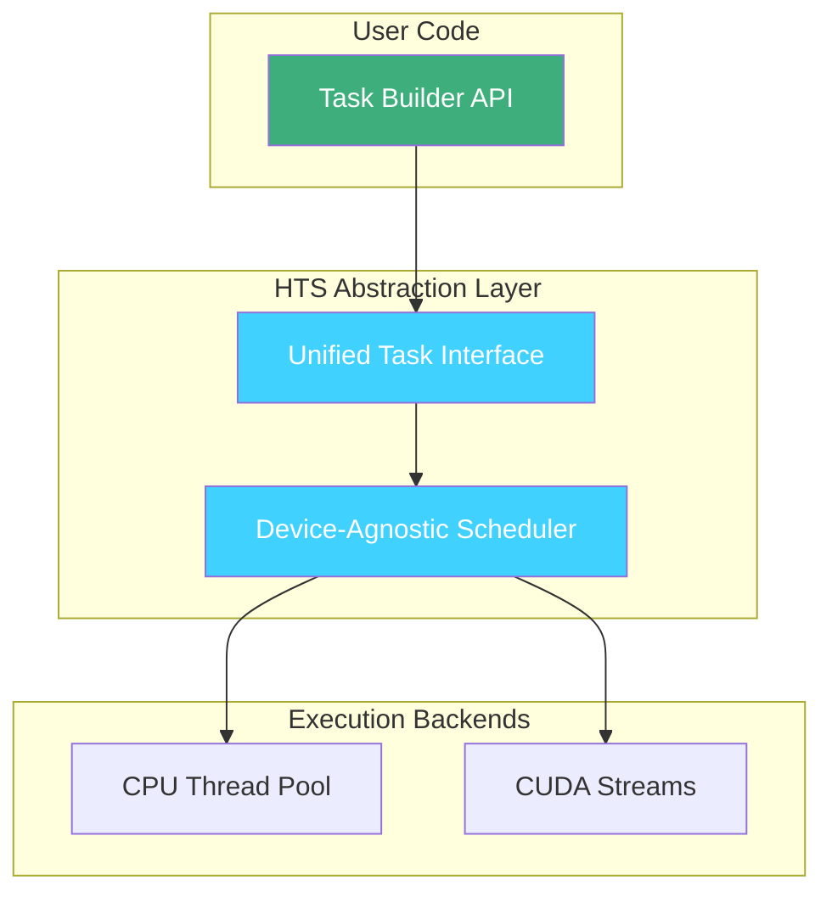
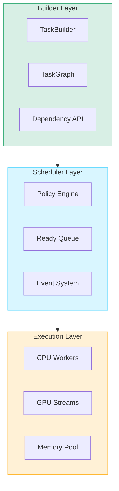
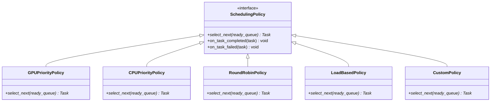
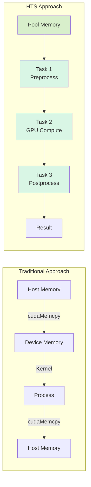

# Design Philosophy

This document explains the core design decisions and architectural philosophy behind HTS.

## Unified Abstraction for Heterogeneous Computing

### Why Unified API?

HTS was designed with a single, consistent API that abstracts away the complexity of heterogeneous computing:



**Key benefits:**

- **Single mental model**: Developers think in terms of tasks and dependencies, not device-specific code
- **Portability**: Same code runs on CPU-only or CPU+GPU systems
- **Maintainability**: Changes to execution backend don't affect user code

### CPU/GPU Task Abstraction

Both CPU and GPU tasks share the same interface:

```cpp
// CPU task
auto cpu_task = builder
    .create_task("Preprocess")
    .device(DeviceType::CPU)
    .cpu_func([](TaskContext& ctx) { /* ... */ })
    .build();

// GPU task - same pattern, different device
auto gpu_task = builder
    .create_task("Compute")
    .device(DeviceType::GPU)
    .gpu_func([](TaskContext& ctx, cudaStream_t stream) { /* ... */ })
    .build();

// Dependencies work identically
graph.add_dependency(cpu_task->id(), gpu_task->id());
```

### Zero Learning Cost Migration

The design principle: **If you know how to write a function, you know how to write a task.**

- No new programming paradigm to learn
- No DSL (Domain-Specific Language) required
- Standard C++ lambdas and function objects
- Gradual adoption: start with one task, expand to DAG

---

## DAG-First Architecture

### Layered Design Motivation

HTS uses a three-layer architecture where DAG is the central concept:



### Layer Responsibilities

| Layer | Responsibility | Key Classes |
|-------|----------------|-------------|
| **Builder** | DAG construction, validation, task configuration | `TaskBuilder`, `TaskGraph` |
| **Scheduler** | Dependency resolution, task selection, state management | `Scheduler`, `SchedulingPolicy` |
| **Execution** | Task dispatch, resource management, memory pooling | `ExecutionEngine`, `MemoryPool` |

### Why DAG-Centric?

1. **Natural expression of real workloads**: Most computational pipelines have inherent dependencies
2. **Automatic parallelization**: Independent tasks execute in parallel without explicit threading
3. **Error propagation**: Failures propagate along dependency edges naturally
4. **Optimization opportunities**: DAG structure enables static analysis and scheduling optimization

### Clean Layer Boundaries

Each layer has a single responsibility:

```cpp
// Builder Layer: Define WHAT to execute
TaskGraph graph;
TaskBuilder builder(graph);
auto task = builder.name("MyTask").cpu(my_func).build();

// Scheduler Layer: Decide WHEN and WHERE to execute
Scheduler scheduler;
scheduler.set_policy(std::make_unique<GPUPriorityPolicy>());
scheduler.init(&graph);

// Execution Layer: Execute HOW
scheduler.execute();  // Handled internally
```

---

## Pluggable Scheduling Policies

### Strategy Pattern in Action

The scheduling policy uses the Strategy pattern:



### Open-Closed Principle

The scheduler is **open for extension, closed for modification**:

```cpp
// Built-in policies work out of the box
scheduler.set_policy(std::make_unique<GPUPriorityPolicy>());

// Custom policies extend without modifying core code
class MyCustomPolicy : public SchedulingPolicy {
public:
    Task* select_next(std::vector<Task*>& ready_queue) override {
        // Your custom logic here
        return /* ... */;
    }
};

scheduler.set_policy(std::make_unique<MyCustomPolicy>());
```

### Extension Points

HTS provides clear extension points for customization:

| Extension Point | Base Class | Purpose |
|-----------------|------------|---------|
| Scheduling Policy | `SchedulingPolicy` | Control task selection order |
| Retry Policy | `RetryPolicy` | Customize failure recovery |
| Memory Allocator | `MemoryPool` | Custom allocation strategies |
| Event Hooks | `EventHandler` | Observe execution lifecycle |

---

## Memory Management Philosophy

### Zero-Copy Design Principle

HTS minimizes unnecessary data movement:



**Key design decisions:**

- Memory stays on device across GPU task chain
- Pool allocation eliminates `cudaMalloc`/`cudaFree` overhead
- Task-to-task data passing via `TaskContext`

### Why Buddy System?

The buddy system allocator was chosen for specific reasons:

| Requirement | Buddy System | Alternative: Slab Allocator |
|-------------|--------------|------------------------------|
| Variable-size allocations | ✅ Excellent | ❌ Fixed sizes only |
| O(log n) allocation | ✅ Yes | ✅ O(1) for fixed sizes |
| Defragmentation | ✅ Built-in coalescing | ❌ Manual management |
| Memory efficiency | ⚠️ ~25% internal fragmentation | ✅ Minimal fragmentation |

**Decision rationale:**

1. **Workload characteristics**: HTS tasks request varying memory sizes
2. **Simplicity**: Buddy system is easier to implement correctly
3. **Predictable performance**: O(log n) worst-case, no fragmentation spikes
4. **Defragmentation**: Natural coalescing reduces manual intervention

### GPU Memory Pool Special Handling

GPU memory has unique constraints that influenced the design:

```cpp
// Memory pool handles GPU-specific concerns:
MemoryPoolConfig config;
config.pool_size_mb = 4096;           // Pre-allocate to avoid cudaMalloc
config.min_block_size_kb = 4;         // Align to CUDA requirements
config.enable_defragmentation = true; // Auto-merge buddies

// Task-scoped allocation ensures proper cleanup
task->set_gpu_function([](TaskContext& ctx, cudaStream_t stream) {
    void* ptr = ctx.allocate_gpu(size);  // From pool, not cudaMalloc
    // ... use memory ...
    // Automatically returned to pool on task completion
});
```

---

## Design Trade-offs

### Explicit vs. Implicit

HTS chooses **explicit over implicit** in several areas:

| Feature | HTS Approach | Alternative |
|---------|--------------|-------------|
| Device selection | `DeviceType::CPU` or `DeviceType::GPU` | Auto-detect based on code |
| Dependencies | `graph.add_dependency(a, b)` | Infer from data flow |
| Memory lifetime | Task-scoped | Garbage collection |

**Rationale**: Explicit declarations enable:
- Better error messages
- More predictable behavior
- Easier debugging
- Static analysis opportunities

### Abstraction vs. Control

HTS provides **high-level abstraction with escape hatches**:

```cpp
// High-level: Let HTS manage everything
auto task = builder.name("Compute").gpu(my_kernel).build();

// Low-level: Direct control when needed
task->set_gpu_function([](TaskContext& ctx, cudaStream_t stream) {
    // Full access to CUDA stream, memory pool, etc.
    cudaStreamAttrValue attr;
    attr.accessPolicyWindow.base_ptr = /* ... */;
    cudaStreamSetAttribute(stream, cudaStreamAttributeAccessPolicyWindow, &attr);
});
```

### Safety vs. Performance

HTS defaults to **safe by default, fast by opt-in**:

| Default Behavior | Opt-in Optimization |
|------------------|---------------------|
| Full dependency validation | Skip validation |
| Task-level memory isolation | Shared memory pools |
| Comprehensive error checking | Minimal overhead mode |

---

## Influences and Inspirations

HTS design was influenced by:

- **Task Graph Frameworks**: Intel TBB, OpenMP tasks, StarPU
- **DAG Systems**: Apache Airflow, Luigi, Dagster
- **Memory Pools**: jemalloc, CUDA memory pools
- **Scheduling Theory**: Operating system schedulers, HPC schedulers

---

## Summary

HTS's design philosophy can be summarized as:

1. **Simplicity First**: Unified API, minimal concepts to learn
2. **DAG-Centric**: Dependencies drive everything
3. **Extensibility**: Policy pattern, clear extension points
4. **Efficiency**: Zero-copy, pooled memory, O(log n) operations
5. **Explicitness**: Clear control, predictable behavior

These principles guide all design decisions in HTS, from high-level architecture to low-level implementation details.
