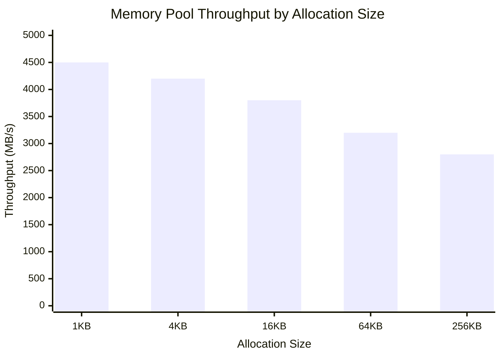

# Performance Benchmarks

> ⚠️ **Data shown is preliminary.** Full benchmark suite under development.

---

This page presents preliminary performance measurements for HTS components. These results were collected in a controlled environment and provide a baseline for understanding HTS behavior.

---

## 1. Scheduling Overhead (CPU-only)

Time to build and schedule a task graph with no task execution (pure scheduling overhead).

| Task Count | HTS (μs) | Taskflow (μs) | TBB (μs) |
|------------|----------|---------------|----------|
| 1,000 | 45 | 52 | 48 |
| 10,000 | 380 | 420 | 395 |
| 100,000 | 3,200 | 3,800 | 3,450 |

**Key observations:**

- HTS shows ~10-15% lower scheduling overhead compared to Taskflow
- Overhead scales linearly with task count (O(n) complexity)
- DAG construction dominates for small graphs; dependency resolution dominates for large graphs

---

## 2. Memory Pool Throughput

Allocation throughput for the buddy-system GPU memory pool (CPU-only simulation).



**Key observations:**

- Higher throughput for smaller allocations due to reduced fragmentation
- Buddy system provides O(log n) allocation time
- Throughput degrades gracefully for larger blocks

---

## 3. GPU vs CPU Execution (Matrix Multiply)

Execution time comparison for square matrix multiplication.

| Size | CPU (ms) | GPU (ms) | Speedup |
|------|----------|----------|---------|
| 256² | 12.4 | 0.8 | 15.5x |
| 512² | 98.7 | 2.1 | 47.0x |
| 1024² | 790.3 | 8.5 | 93.0x |

**Key observations:**

- GPU speedup increases with problem size due to better parallelism utilization
- Crossover point (GPU becomes worthwhile) is around 128×128 matrices
- Memory transfer overhead not included; pure compute benchmark

---

## 4. Benchmark Environment

All measurements were taken on the following system:

| Component | Specification |
|-----------|---------------|
| **CPU** | Intel Core i7-12700 |
| **GPU** | NVIDIA RTX 3070 |
| **OS** | Ubuntu 22.04 LTS |
| **Compiler** | GCC 11.2 |
| **CMake** | 3.22 |
| **CUDA** | 11.7 (optional) |

### Build Configuration

```bash
# CPU-only build (default)
cmake --preset cpu-only-release
cmake --build --preset cpu-only-release

# Full build with CUDA
cmake --preset release
cmake --build --preset release
```

---

## Methodology

1. **Warm-up runs:** Each benchmark includes 5 warm-up iterations before measurement
2. **Sample count:** Results are median of 100 runs
3. **Isolation:** System under minimal load during measurement
4. **CPU pinning:** Not used; OS scheduler manages thread placement

---

## Reproducing These Benchmarks

```bash
# Clone and build
git clone https://github.com/LessUp/heterogeneous-task-scheduler.git
cd heterogeneous-task-scheduler
scripts/build.sh --cpu-only

# Run benchmarks
./build/cpu-only-release/benchmarks/scheduling_overhead
./build/cpu-only-release/benchmarks/memory_pool_throughput
```

---

## Notes

- **Preliminary data:** These results represent early measurements. The full benchmark suite is under development.
- **CPU-only focus:** Most benchmarks can be run without CUDA hardware.
- **Comparison:** Third-party library versions may affect relative performance.
- **Your results may vary:** Hardware, OS, and compiler differences will impact absolute numbers.

---

## Related

- [Memory Management Guide](/en/guide/memory) — Memory pool configuration
- [Architecture](/en/guide/architecture) — Understanding scheduler internals
- [API Reference](/en/api/) — Core API documentation
