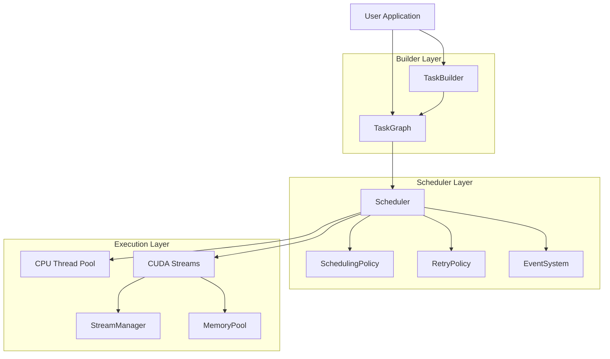
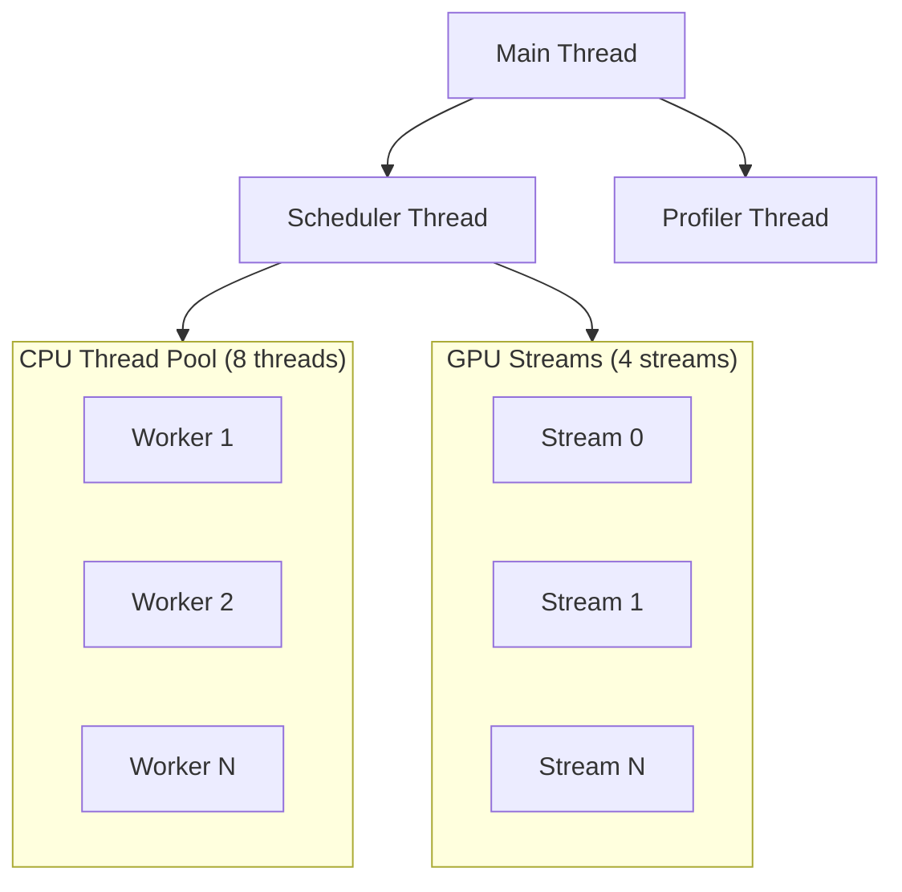
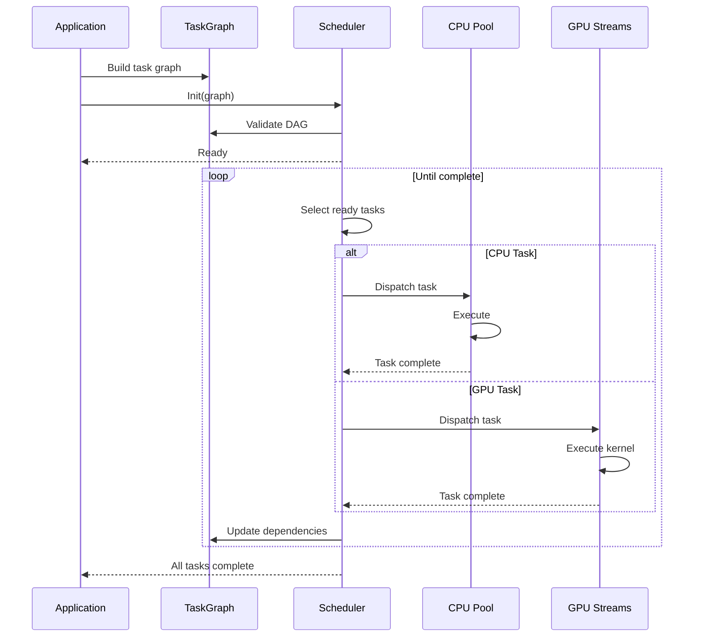
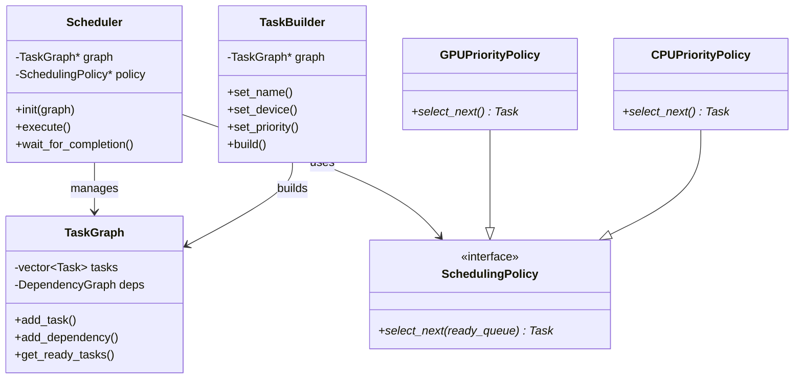

# Architecture

This page explains the internal architecture and design of HTS.

## High-Level Architecture



## Core Components

### 1. TaskGraph

The `TaskGraph` class manages the DAG (Directed Acyclic Graph) of tasks:

- **Task Storage**: Maintains all tasks with their configurations
- **Dependency Tracking**: Tracks predecessor/successor relationships
- **Topological Sorting**: Provides execution order
- **Cycle Detection**: Validates DAG structure
- **Ready Queue**: Identifies tasks ready for execution

**Key Files:**
- `include/hts/task_graph.hpp`
- `src/core/task_graph.cpp`

### 2. Task and TaskContext

Each task is represented by a `Task` object with an associated `TaskContext`:

**Task Properties:**
```cpp
- id: uint64_t              // Unique identifier
- name: string              // Human-readable name
- device_type: DeviceType   // CPU or GPU
- priority: int            // Scheduling priority
- status: TaskStatus       // Current execution state
- retry_policy: RetryPolicy // Failure handling
```

**TaskContext:**
Provides runtime information and utilities to task functions:
```cpp
- get_task_id()
- get_device_type()
- get_execution_time()
- get_retry_count()
```

**Key Files:**
- `include/hts/task.hpp`
- `include/hts/task_context.hpp`
- `src/core/task.cpp`

### 3. Scheduler

The `Scheduler` orchestrates the entire execution:

**Responsibilities:**
- Initialize and validate TaskGraph
- Maintain execution state
- Select ready tasks based on policy
- Dispatch tasks to appropriate executors
- Track completion and handle failures
- Collect profiling information

**Execution Flow:**
1. `init(&graph)` - Validate and prepare
2. `execute()` - Start execution
3. Policy selects ready tasks
4. Tasks dispatched to CPU threads or GPU streams
5. `wait_for_completion()` - Block until done
6. Collect stats and profiling data

**Key Files:**
- `include/hts/scheduler.hpp`
- `src/cuda/scheduler.cu`

### 4. Scheduling Policies

HTS uses a pluggable policy architecture:

```cpp
class SchedulingPolicy {
    virtual Task* select_next(
        const std::vector<Task*>& ready_queue
    ) = 0;
};
```

**Built-in Policies:**

| Policy | Strategy | Use Case |
|--------|----------|----------|
| `GPUPriorityPolicy` | Prefer GPU tasks | GPU-heavy workloads |
| `CPUPriorityPolicy` | Prefer CPU tasks | CPU preprocessing |
| `RoundRobinPolicy` | Alternate CPU/GPU | Balanced workloads |
| `LoadBasedPolicy` | Select by current load | Dynamic workloads |

**Key Files:**
- `include/hts/scheduling_policy.hpp`

### 5. Memory Pool

GPU memory management uses a buddy system allocator:

**Features:**
- Eliminates `cudaMalloc`/`cudaFree` overhead
- O(log n) allocation time
- Automatic defragmentation
- Configurable pool size

**Allocation Flow:**
1. Task requests GPU memory
2. MemoryPool finds suitable block
3. Splits blocks if needed (buddy system)
4. Returns pointer
5. On free, merges with buddy if possible

**Key Files:**
- `include/hts/memory_pool.hpp`
- `src/cuda/memory_pool.cu`

### 6. Stream Manager

Manages CUDA streams for concurrent GPU execution:

**Capabilities:**
- Create and manage multiple streams
- Stream priority support
- Automatic stream reuse
- Synchronization primitives

**Key Files:**
- `include/hts/stream_manager.hpp`
- `src/cuda/stream_manager.cu`

### 7. Execution Engine

Dispatches tasks to CPU threads or GPU streams:

**CPU Execution:**
- Thread pool for parallel execution
- Work-stealing support
- Affinity configuration

**GPU Execution:**
- CUDA stream management
- Kernel launch coordination
- Memory transfer handling

**Key Files:**
- `include/hts/execution_engine.hpp`
- `src/cuda/execution_engine.cu`

### 8. Profiler

Built-in performance monitoring:

**Metrics Collected:**
- Task execution times
- Device utilization
- Memory allocation patterns
- Dependency wait times
- Parallelism metrics

**Export:**
- JSON format
- Chrome tracing format
- CSV format

**Key Files:**
- `include/hts/profiler.hpp`

## Design Principles

### Zero-Overhead Abstraction

HTS follows the C++ principle of "you don't pay for what you don't use":

- No virtual calls in hot paths (when not using polymorphic features)
- Compile-time device type selection when possible
- Inline functions for simple operations
- Template metaprogramming for type safety

### Lock-Free Where Possible

Critical paths use lock-free data structures:
- Atomic operations for status updates
- Lock-free queues for ready tasks
- Compare-and-swap for state transitions

### Error Resilience

- Comprehensive error codes (see `types.hpp`)
- Retry policies for transient failures
- Graceful degradation on errors
- Detailed error messages with context

## Threading Model



## Execution Flow



## Core Class Relationships



## Next Steps

- [Task Graph](/en/guide/task-graph) — Deep dive into DAG management
- [Scheduling](/en/guide/scheduling) — Scheduling policies in detail
- [Memory](/en/guide/memory) — Memory pool implementation
- [API Reference](/en/api/) — Complete API documentation
