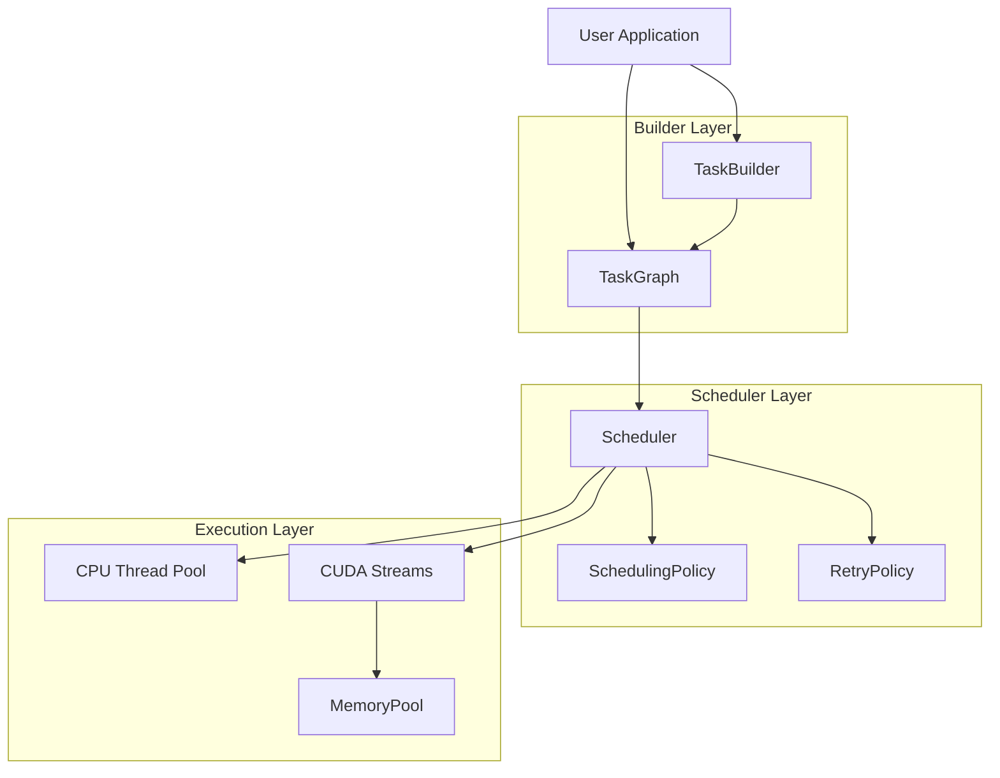

## Core Value Proposition

> **"If you can write a function, you can write a task"** — Zero-learning-cost unified abstraction

HTS is a C++17 heterogeneous task scheduling library with DAG-First architecture. It allows you to seamlessly mix CPU and GPU tasks in the same task graph, automatically handling dependencies, memory management, and concurrent execution.

## Architecture Overview



## Academic Foundation

HTS is an engineering implementation based on classic algorithms:

| Algorithm | Paper | HTS Implementation |
|-----------|-------|-------------------|
| **HEFT Scheduling** | Topcuoglu et al., 2002 | `include/hts/scheduling_policy.hpp` |
| **Buddy System** | Knowlton, 1965 | `src/cuda/memory_pool.cu` |
| **Topological Sort** | Kahn, 1962 | `src/core/task_graph.cpp` |

::: info Academic References
HTS scheduling algorithm is based on HEFT (Heterogeneous Earliest-Finish-Time) algorithm, and memory management uses the classic Buddy System allocator. See [Related Work](/en/research/related-work) and [References](/en/research/references).
:::

## Framework Comparison

| Framework | Language | GPU Support | DAG Support | License | Heterogeneous Scheduling |
|-----------|----------|-------------|-------------|---------|------------------------|
| **HTS** | C++17 | CUDA | Native | MIT | ✅ HEFT+Stream-aware |
| StarPU | C | CUDA/OpenCL | Yes | LGPL | ✅ Mature runtime |
| Kokkos | C++ | CUDA/HIP | No | BSD | ❌ Programming model |
| HPX | C++ | Limited | Yes | Boost | ⚠️ Experimental |
| TBB | C++ | No | Yes | Apache | ❌ CPU only |
| Taskflow | C++17 | No | Yes | MIT | ❌ CPU only |

## Quick Start

::: code-group
```bash [Clone Repository]
git clone https://github.com/AICL-Lab/heterogeneous-task-scheduler.git
cd heterogeneous-task-scheduler
```

```bash [Build (CPU-only)]
scripts/build.sh --cpu-only
```

```bash [Build (with CUDA)]
scripts/build.sh -DHTS_ENABLE_CUDA=ON
```

```bash [Run Tests]
scripts/test.sh
```
:::

## Code Example

```cpp
#include <hts/task_graph.hpp>
#include <hts/scheduler.hpp>

int main() {
    // 1. Create task graph
    hts::TaskGraph graph;

    // 2. Add tasks
    auto load = graph.add_task("load_data", [] {
        // CPU task: load data
    });

    auto process = graph.add_task("process_gpu",
        [](hts::TaskContext& ctx, cudaStream_t stream) {
            // GPU task: CUDA kernel
        });

    auto save = graph.add_task("save_result", [] {
        // CPU task: save results
    });

    // 3. Declare dependencies
    graph.add_dependency(load, process);
    graph.add_dependency(process, save);

    // 4. Execute
    hts::Scheduler scheduler;
    scheduler.execute(graph);

    return 0;
}
```

## Key Features

| Feature | Description |
|---------|-------------|
| **C++17 Native** | Modern C++ with zero-overhead abstractions |
| **DAG-First** | Dependency-aware task scheduling |
| **CPU + GPU** | Heterogeneous execution support |
| **Memory Pool** | Buddy allocator for GPU memory |
| **Pluggable Policies** | Custom scheduling policy interface |
| **Profiling** | Built-in performance monitoring and timeline export |
