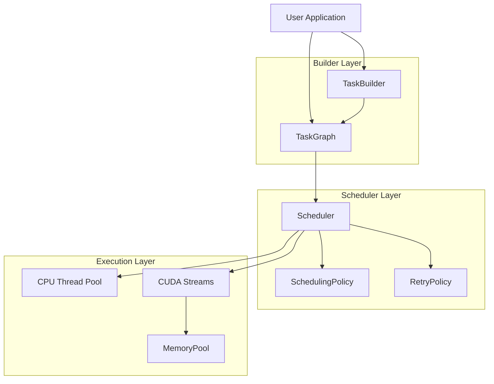

<script setup>
import { VPTeamMembers } from 'vitepress/theme'

const coreFeatures = [
  {
    avatar: { src: '/logo.svg' },
    name: 'DAG-First Execution',
    desc: 'Build dependency-aware pipelines with TaskGraph and TaskBuilder. Automatic topological ordering ensures correct execution sequence.',
    links: [
      { icon: 'github', link: '/en/guide/architecture' }
    ]
  },
  {
    avatar: { src: '/logo.svg' },
    name: 'Heterogeneous Computing',
    desc: 'Seamlessly mix CPU and GPU tasks in the same graph. CUDA streams and memory pools managed automatically when available.',
    links: [
      { icon: 'github', link: '/en/guide/scheduling' }
    ]
  },
  {
    avatar: { src: '/logo.svg' },
    name: 'Memory Pool',
    desc: 'GPU memory pooling reduces allocation overhead. Buddy system allocator with automatic defragmentation.',
    links: [
      { icon: 'github', link: '/en/guide/memory' }
    ]
  }
]
</script>

## Core Features

<VPTeamMembers size="small" :members="coreFeatures" />

## Quick Start

::: code-group
```bash [Clone]
git clone https://github.com/LessUp/heterogeneous-task-scheduler.git
cd heterogeneous-task-scheduler
```

```bash [Build (CPU-only)]
scripts/build.sh --cpu-only
```

```bash [Build (with CUDA)]
scripts/build.sh -DHTS_ENABLE_CUDA=ON
```
:::

## Architecture Overview



## Key Metrics

| Feature | Description |
|---------|-------------|
| **C++17 Native** | Modern C++ with zero-overhead abstractions |
| **DAG-First** | Dependency-aware task scheduling |
| **CPU + GPU** | Heterogeneous execution support |
| **Memory Pool** | Buddy allocator for GPU memory |
| **Profiling** | Built-in performance monitoring |
