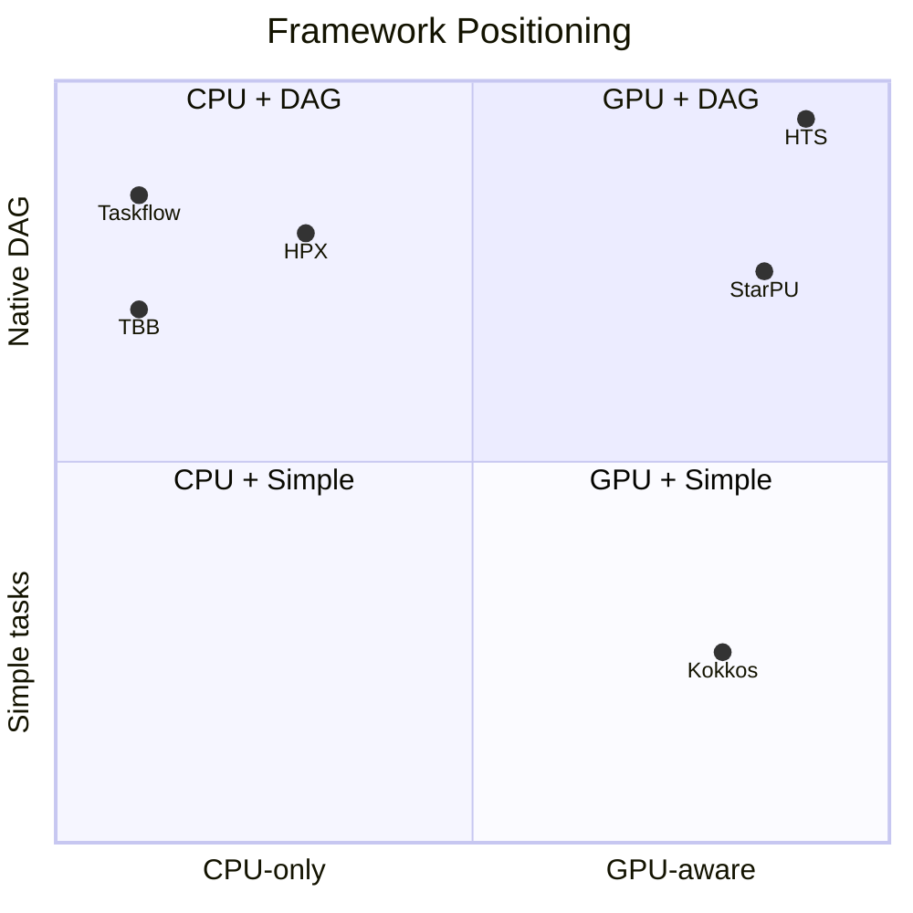
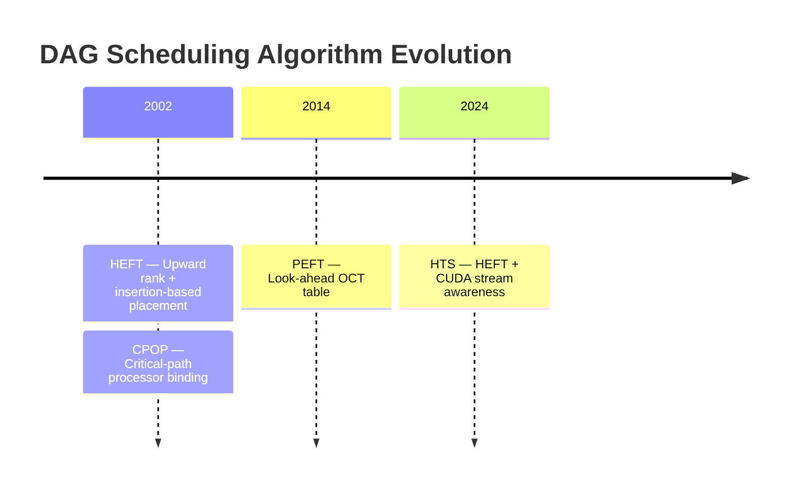

# Related Work

This page surveys the theoretical foundations, scheduling algorithms, memory management techniques, and GPU programming practices that inform the design of HTS (Heterogeneous Task Scheduler).

## Task Scheduling Frameworks

The following table compares HTS with other prominent task scheduling frameworks across key dimensions.

| Framework  | Language | GPU Support        | DAG Support    | License |
| ---------- | -------- | ------------------ | -------------- | ------- |
| **HTS**    | C++17    | CUDA               | Native         | MIT     |
| StarPU     | C        | CUDA / OpenCL      | Yes            | LGPL    |
| Kokkos     | C++      | CUDA / HIP         | No             | BSD     |
| HPX        | C++      | Limited            | Yes            | Boost   |
| TBB        | C++      | No                 | Yes            | Apache  |
| Taskflow   | C++17    | No                 | Yes            | MIT     |

### Comparison Notes

- **HTS** distinguishes itself through native DAG scheduling on heterogeneous CPU + GPU systems, combining a HEFT-based priority strategy with CUDA stream-aware execution.
- **StarPU** [Augonnet et al., 2011] offers the broadest accelerator support (CUDA, OpenCL) and a mature runtime, but relies on a C codebase and LGPL licensing can constrain adoption.
- **Kokkos** [Edwards et al., 2014] excels at performance portability across GPU vendors but does not provide a task DAG scheduler; it is primarily a parallel programming model.
- **HPX** [Kaiser et al., 2009] implements a ParalleX runtime with fine-grained task scheduling, but GPU support remains experimental.
- **TBB** [Reinders, 2007] provides robust CPU task scheduling with dependency graphs but lacks GPU awareness entirely.
- **Taskflow** [Huang et al., 2022] shares HTS's C++17 baseline and MIT license and offers expressive DAG composition, but targets CPU-only execution.



## Theoretical Foundations

HTS draws on three decades of research in DAG scheduling for heterogeneous systems.

### HEFT Algorithm

**Heterogeneous Earliest Finish Time** — Topcuoglu, Hariri, and Wu [2002].

HEFT is a list-scheduling heuristic with two phases:

1. **Prioritization** — Compute the *upward rank* $rank_u(v_i)$ for each task $v_i$:

$$rank_u(v_i) = \overline{w_i} + \max_{v_j \in succ(v_i)} \left( \overline{c_{i,j}} + rank_u(v_j) \right)$$

   where $\overline{w_i}$ is the average computation cost and $\overline{c_{i,j}}$ is the average communication cost on edge $(v_i, v_j)$. Tasks are scheduled in decreasing order of upward rank.

2. **Processor Selection** — Each task is placed on the processor that yields the earliest finish time, inserting the task into the earliest idle slot (insertion-based policy).

HEFT achieves near-optimal makespan for arbitrary DAGs on heterogeneous processors and is the algorithmic foundation of HTS's priority queue.

### CPOP Algorithm

**Critical Path on Processor** — Topcuoglu, Hariri, and Wu [2002].

CPOP identifies the critical path of the DAG and schedules all critical-path tasks on a single processor that minimizes the total critical-path cost. Non-critical tasks are scheduled using the earliest-finish-time strategy on the remaining processors.

- **Strength**: Guarantees that the critical path incurs zero inter-processor communication.
- **Limitation**: May underutilize available parallelism when the critical path is long but narrow.

### PEFT Algorithm

**Predict Earliest Finish Time** — Arabnejad and Barbosa [2014].

PEFT improves upon HEFT by introducing an *optimistic cost table* (OCT) that pre-computes the earliest finish time of each task on each processor, assuming all predecessor tasks finish at their earliest possible times. This look-ahead mechanism enables better processor selection without increasing scheduling complexity.

- **Time complexity**: $O(v^2 \times p)$, same as HEFT, where $v$ is the number of tasks and $p$ the number of processors.
- **Improvement over HEFT**: Typically 5--15% reduction in makespan on benchmark DAGs.



## Memory Pool Design References

HTS employs a buddy-system memory pool for efficient GPU-side allocation. The design is informed by classical memory management research.

### Buddy System

**Knowlton [1965]** — A fast storage allocator based on binary splitting.

Key properties:

| Property           | Value          | Notes                                          |
| ------------------ | -------------- | ---------------------------------------------- |
| Allocation cost    | $O(\log n)$    | Split larger blocks recursively                |
| Deallocation cost  | $O(\log n)$    | Coalesce adjacent buddies recursively           |
| Internal fragment. | $\le 50\%$     | Worst case: request is $2^k + 1$, block is $2^{k+1}$ |
| External fragment. | None           | Any free block can be split to satisfy request  |

HTS adapts the buddy system for CUDA device memory, where `cudaMalloc` / `cudaFree` calls are expensive due to driver overhead. Pooling amortizes these costs across many small task-data allocations.

### Related Memory Strategies

- **Slab allocation** [Bonwick, 1994] — Object-caching allocator used in the Linux kernel. Better than buddy for fixed-size objects but less flexible for variable-size GPU buffers.
- **Region-based allocation** [Tofte & Talpin, 1997] — All allocations in a region are freed together. Used in HTS for per-DAG scratch space that is reclaimed when the DAG completes.

## CUDA Stream Management Best Practices

HTS exploits CUDA streams to achieve concurrent kernel execution across multiple GPUs and within a single GPU. The design follows NVIDIA's recommended practices.

### Multi-Stream Concurrency

CUDA streams enable overlapping of kernel execution, data transfers, and host-side computation:

```mermaid
gantt
    title CUDA Stream Concurrency
    dateFormat X
    axisFormat %s

    section Stream 0
    H2D Transfer  :s0_h2d, 0, 2
    Kernel A      :s0_kern, 2, 5
    D2H Transfer  :s0_d2h, 5, 7

    section Stream 1
    H2D Transfer  :s1_h2d, 1, 3
    Kernel B      :s1_kern, 3, 6
    D2H Transfer  :s1_d2h, 6, 8

    section Stream 2
    H2D Transfer  :s2_h2d, 2, 4
    Kernel C      :s2_kern, 4, 7
```



HTS assigns one CUDA stream per task by default and resolves inter-task dependencies via CUDA events rather than global synchronization.

### Event Synchronization

CUDA events provide lightweight inter-stream synchronization:

```cpp
// Record completion of producer task
cudaEventRecord(producer_done, producer_stream);

// Consumer stream waits on producer
cudaStreamWaitEvent(consumer_stream, producer_done, 0);
```

This pattern replaces `cudaDeviceSynchronize()` with fine-grained dependencies, allowing independent streams to proceed without stalls.

### Key Guidelines

1. **Avoid default stream** — Operations in the default stream (stream 0) serialize across all streams on pre-CUDA 7 hardware and with the default legacy flag.
2. **Pool streams** — Creating and destroying streams is expensive. HTS maintains a stream pool recycled across DAG executions.
3. **Minimize host-device synchronization** — Use events and callbacks instead of `cudaStreamSynchronize()` whenever possible.
4. **Respect concurrency limits** — A GPU has a finite number of SMs; launching too many concurrent kernels can degrade performance due to resource contention.

## References

1. Arabnejad, H. and Barbosa, J.G. (2014). List scheduling algorithm for heterogeneous systems by an optimistic cost table. *Journal of Parallel and Distributed Computing*, 74(10), 2959--2973. https://doi.org/10.1016/j.jpdc.2014.06.007

2. Augonnet, C., Thibault, S., Namyst, R., and Wacrenier, P.-A. (2011). StarPU: A unified platform for task scheduling on heterogeneous multicore architectures. *Concurrency and Computation: Practice and Experience*, 23(2), 187--198. https://doi.org/10.1002/cpe.1631

3. Bonwick, J. (1994). The slab allocator: An object-caching kernel memory allocator. In *Proceedings of the USENIX Summer Technical Conference*.

4. Edwards, H.C., Trott, C.R., and Sunderland, D. (2014). Kokkos: Enabling manycore performance portability through an abstract programming model. *International Journal of High Performance Computing Applications*, 28(4), 420--434. https://doi.org/10.1177/1094342014528137

5. Huang, C.-H., Langer, M., and Kuhweide, D. (2022). Cpp-Taskflow: A general-purpose parallel task programming system at scale. *IEEE Transactions on Parallel and Distributed Systems*, 33(6), 1407--1419. https://doi.org/10.1109/TPDS.2021.3122995

6. Kaiser, H., Brodowicz, M., and Sterling, T. (2009). ParalleX: An advanced parallel execution model for scaling-impaired applications. In *Proceedings of the International Conference on Parallel Processing Workshops*.

7. Knowlton, K.C. (1965). A fast storage allocator. *Communications of the ACM*, 8(10), 623--624. https://doi.org/10.1145/365628.365655

8. NVIDIA Corporation (2025). *CUDA C++ Programming Guide*, v12.8. https://docs.nvidia.com/cuda/cuda-c-programming-guide/

9. Reinders, J. (2007). *Intel Threading Building Blocks: Outfitting C++ for Multi-core Processor Parallelism*. O'Reilly Media.

10. Tofte, M. and Talpin, J.-P. (1997). Region-based memory management. *Information and Computation*, 132(2), 109--176. https://doi.org/10.1006/inco.1996.2613

11. Topcuoglu, H., Hariri, S., and Wu, M.-Y. (2002). Performance-effective and low-complexity task scheduling for heterogeneous computing. *IEEE Transactions on Parallel and Distributed Systems*, 13(3), 260--274. https://doi.org/10.1109/71.993206
