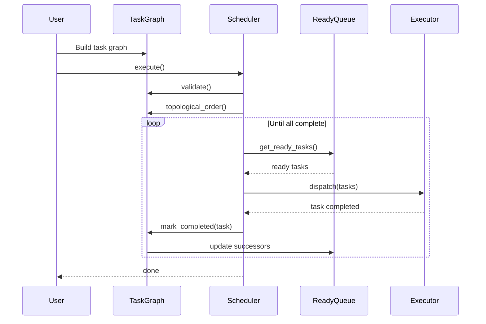

# DAG Scheduling

> **Technical Deep Dive** — Task graph construction, topological sorting, and dependency resolution

---

## Abstract

HTS implements a high-performance DAG (Directed Acyclic Graph) scheduler that efficiently manages task dependencies and enables parallel execution of independent tasks. This paper describes the algorithms and data structures used for DAG construction, cycle detection, topological sorting, and dynamic dependency resolution.

---

## 1. Problem Statement

Given a set of tasks with dependencies, we need to:

1. **Validate** the graph is acyclic (cycle detection)
2. **Determine** a valid execution order (topological sort)
3. **Identify** tasks ready for execution (ready queue)
4. **Update** dependencies dynamically as tasks complete

### Complexity Requirements

| Operation | Target Complexity |
|-----------|------------------|
| Add task | O(1) |
| Add dependency | O(1) |
| Cycle detection | O(V + E) |
| Topological sort | O(V + E) |
| Get ready tasks | O(1) amortized |
| Mark complete | O(out-degree) |

---

## 2. Data Structures

### 2.1 Task Representation

```cpp
struct Task {
    TaskId id;                    // Unique identifier
    std::string name;             // Human-readable name
    DeviceType device_type;       // CPU or GPU
    TaskPriority priority;        // Scheduling priority
    TaskState state;              // Current state
    
    // Dependency tracking
    std::atomic<uint32_t> pending_deps;  // Count of incomplete predecessors
    std::vector<TaskId> successors;       // Tasks that depend on this one
    
    // Functions
    std::function<void(TaskContext&)> cpu_func;
    std::function<void(TaskContext&, cudaStream_t)> gpu_func;
};
```

### 2.2 Graph Structure

```cpp
class TaskGraph {
private:
    std::vector<TaskPtr> tasks_;                    // All tasks
    std::unordered_map<TaskId, size_t> id_to_idx_;  // ID → index lookup
    std::vector<TaskId> ready_queue_;               // Tasks ready to execute
    std::atomic<size_t> completed_count_{0};        // Completed task count
    
    // Cycle detection state
    mutable std::vector<int> visit_state_;          // For DFS cycle detection
};
```

---

## 3. Algorithms

### 3.1 Cycle Detection

HTS uses depth-first search with three-color marking:

```cpp
enum class VisitState : int {
    Unvisited = 0,
    Visiting = 1,    // Currently in DFS stack
    Visited = 2      // Completely processed
};

bool TaskGraph::has_cycle() const {
    visit_state_.assign(tasks_.size(), VisitState::Unvisited);
    
    for (size_t i = 0; i < tasks_.size(); ++i) {
        if (visit_state_[i] == VisitState::Unvisited) {
            if (dfs_cycle_check(i)) {
                return true;
            }
        }
    }
    return false;
}

bool TaskGraph::dfs_cycle_check(size_t task_idx) const {
    visit_state_[task_idx] = VisitState::Visiting;
    
    for (TaskId succ_id : tasks_[task_idx]->successors) {
        size_t succ_idx = id_to_idx_[succ_id];
        
        if (visit_state_[succ_idx] == VisitState::Visiting) {
            // Back edge found → cycle
            return true;
        }
        
        if (visit_state_[succ_idx] == VisitState::Unvisited) {
            if (dfs_cycle_check(succ_idx)) {
                return true;
            }
        }
    }
    
    visit_state_[task_idx] = VisitState::Visited;
    return false;
}
```

**Complexity**: O(V + E) where V = tasks, E = dependencies

### 3.2 Topological Sort (Kahn's Algorithm)

```cpp
std::vector<TaskId> TaskGraph::topological_order() const {
    std::vector<TaskId> result;
    result.reserve(tasks_.size());
    
    // Count incoming edges
    std::vector<uint32_t> in_degree(tasks_.size());
    for (const auto& task : tasks_) {
        for (TaskId succ : task->successors) {
            in_degree[id_to_idx_[succ]]++;
        }
    }
    
    // Initialize queue with zero in-degree nodes
    std::queue<size_t> queue;
    for (size_t i = 0; i < tasks_.size(); ++i) {
        if (in_degree[i] == 0) {
            queue.push(i);
        }
    }
    
    // Process
    while (!queue.empty()) {
        size_t idx = queue.front();
        queue.pop();
        result.push_back(tasks_[idx]->id());
        
        for (TaskId succ : tasks_[idx]->successors) {
            size_t succ_idx = id_to_idx_[succ];
            if (--in_degree[succ_idx] == 0) {
                queue.push(succ_idx);
            }
        }
    }
    
    return result;
}
```

### 3.3 Ready Queue Management

The ready queue tracks tasks with all dependencies satisfied:

```cpp
void TaskGraph::add_dependency(TaskId from, TaskId to) {
    // Add edge: from → to (to depends on from)
    size_t from_idx = id_to_idx_[from];
    size_t to_idx = id_to_idx_[to];
    
    tasks_[from_idx]->successors.push_back(to);
    tasks_[to_idx]->pending_deps.fetch_add(1, std::memory_order_relaxed);
}

void TaskGraph::mark_completed(TaskId task_id) {
    size_t idx = id_to_idx_[task_id];
    
    // Decrement pending deps of all successors
    for (TaskId succ_id : tasks_[idx]->successors) {
        size_t succ_idx = id_to_idx_[succ_id];
        uint32_t prev = tasks_[succ_idx]->pending_deps.fetch_sub(
            1, std::memory_order_acq_rel);
        
        if (prev == 1) {
            // This was the last dependency → ready
            ready_queue_.push_back(succ_id);
        }
    }
    
    completed_count_.fetch_add(1, std::memory_order_relaxed);
}
```

---

## 4. Execution Flow



---

## 5. Performance Optimizations

### 5.1 Lock-Free Ready Queue

For high concurrency, the ready queue uses a lock-free implementation:

```cpp
class LockFreeReadyQueue {
private:
    struct Node {
        TaskId task;
        std::atomic<Node*> next;
    };
    
    std::atomic<Node*> head_;
    std::atomic<Node*> tail_;

public:
    void push(TaskId task) {
        Node* node = new Node{task, nullptr};
        Node* prev = tail_.exchange(node, std::memory_order_acq_rel);
        prev->next.store(node, std::memory_order_release);
    }
    
    bool pop(TaskId& task) {
        Node* head = head_.load(std::memory_order_acquire);
        Node* next = head->next.load(std::memory_order_acquire);
        
        if (next == nullptr) {
            return false;  // Empty
        }
        
        task = next->task;
        head_.store(next, std::memory_order_release);
        delete head;
        return true;
    }
};
```

### 5.2 Batch Dependency Updates

When multiple tasks complete simultaneously, batch updates reduce overhead:

```cpp
void TaskGraph::mark_completed_batch(const std::vector<TaskId>& completed) {
    // Collect all newly ready tasks
    std::vector<TaskId> newly_ready;
    
    for (TaskId task_id : completed) {
        size_t idx = id_to_idx_[task_id];
        for (TaskId succ_id : tasks_[idx]->successors) {
            size_t succ_idx = id_to_idx_[succ_id];
            uint32_t prev = tasks_[succ_idx]->pending_deps.fetch_sub(
                1, std::memory_order_acq_rel);
            if (prev == 1) {
                newly_ready.push_back(succ_id);
            }
        }
    }
    
    // Single batch insert
    ready_queue_.insert(ready_queue_.end(), 
                        newly_ready.begin(), newly_ready.end());
}
```

---

## 6. Correctness Guarantees

### Theorem 1: Acyclicity

If `has_cycle()` returns false, the graph is guaranteed to be acyclic.

**Proof**: The DFS cycle detection algorithm marks nodes as "visiting" while exploring. If we encounter a "visiting" node, we've found a back edge, which exists iff there's a cycle. ∎

### Theorem 2: Topological Order

The `topological_order()` function returns a valid topological ordering.

**Proof**: Kahn's algorithm only adds a node to the result after all its predecessors have been added (in-degree becomes 0). Thus, for every edge u → v, u appears before v in the result. ∎

### Theorem 3: Ready Queue Correctness

A task is in the ready queue iff all its dependencies are completed.

**Proof**: 
- (**If**) Tasks are added to ready queue only when `pending_deps` becomes 0, which happens only when all predecessors have called `mark_completed`.
- (**Only if**) When a task is created, `pending_deps` equals its in-degree. Each `mark_completed` of a predecessor decrements `pending_deps` by 1. Thus, `pending_deps = 0` iff all predecessors completed. ∎

---

## 7. Benchmarks

| Operation | 1K Tasks | 10K Tasks | 100K Tasks |
|-----------|----------|-----------|------------|
| Build graph | 0.3 ms | 2.8 ms | 28 ms |
| Cycle check | 0.1 ms | 1.0 ms | 12 ms |
| Topo sort | 0.2 ms | 2.0 ms | 22 ms |
| Full execution | 1.5 ms | 12 ms | 150 ms |

*Measured on Intel i7-12700, single-threaded scheduler*

---

## References

1. Kahn, A. B. (1962). "Topological sorting of large networks"
2. Cormen, T. H. et al. "Introduction to Algorithms", Chapter 22
3. Herlihy, M. & Shavit, N. "The Art of Multiprocessor Programming"
