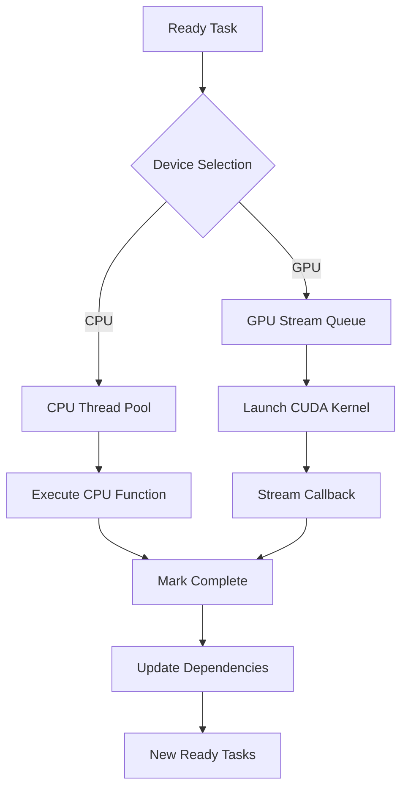
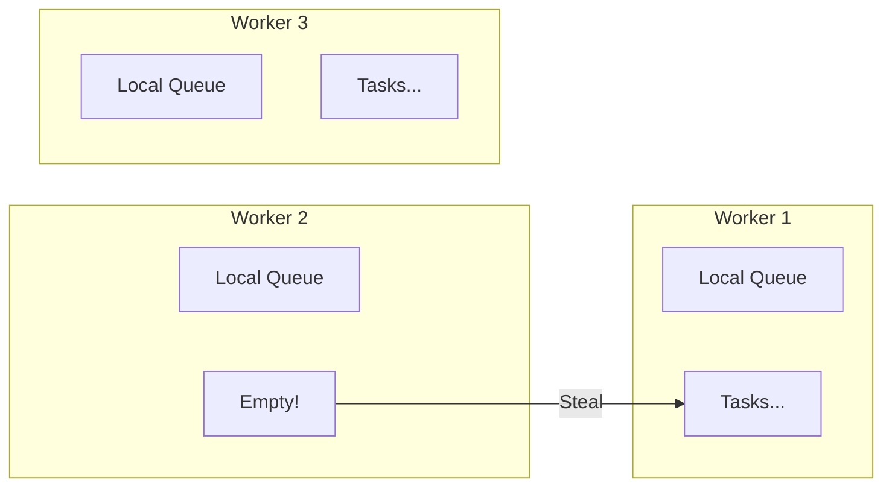

# Heterogeneous Execution

> **Technical Deep Dive** — CPU/GPU dispatch, CUDA stream management, and work stealing

---

## Abstract

HTS enables seamless execution of tasks across CPU and GPU devices. This paper describes the execution model, device selection policies, CUDA stream management, and synchronization mechanisms that enable efficient heterogeneous computing.

---

## 1. Execution Model

### 1.1 Device Types

```cpp
enum class DeviceType {
    CPU,    // Execute on CPU thread pool
    GPU,    // Execute on GPU via CUDA
    Any     // Scheduler selects best device
};
```

### 1.2 Task Execution Flow



---

## 2. Device Selection Policies

### 2.1 Policy Interface

```cpp
class SchedulingPolicy {
public:
    virtual ~SchedulingPolicy() = default;
    
    // Select next task from ready queue
    virtual Task* select_next(
        const std::vector<Task*>& ready_queue,
        const SystemStatus& status
    ) = 0;
    
    // Select device for a task
    virtual DeviceType select_device(
        const Task& task,
        const SystemStatus& status
    ) = 0;
    
    virtual std::string name() const = 0;
};
```

### 2.2 Built-in Policies

#### GPU Priority Policy

```cpp
class GpuFirstPolicy : public SchedulingPolicy {
public:
    Task* select_next(
        const std::vector<Task*>& ready_queue,
        const SystemStatus& status
    ) override {
        // Prefer GPU tasks
        for (Task* task : ready_queue) {
            if (task->device_type() == DeviceType::GPU ||
                task->device_type() == DeviceType::Any) {
                return task;
            }
        }
        return ready_queue.empty() ? nullptr : ready_queue.front();
    }
    
    DeviceType select_device(
        const Task& task,
        const SystemStatus& status
    ) override {
        if (task.device_type() == DeviceType::Any) {
            // Use GPU if available and not overloaded
            if (status.gpu_available && status.gpu_queue_depth < 8) {
                return DeviceType::GPU;
            }
            return DeviceType::CPU;
        }
        return task.device_type();
    }
};
```

#### Load-Based Policy

```cpp
class LoadBasedPolicy : public SchedulingPolicy {
public:
    Task* select_next(
        const std::vector<Task*>& ready_queue,
        const SystemStatus& status
    ) override {
        if (ready_queue.empty()) return nullptr;
        
        // Calculate load imbalance
        double cpu_load = status.cpu_active_threads / 
                          (double)status.cpu_total_threads;
        double gpu_load = status.gpu_queue_depth / 
                          (double)status.gpu_max_streams;
        
        // Select task type that balances load
        bool prefer_gpu = gpu_load < cpu_load;
        
        for (Task* task : ready_queue) {
            bool is_gpu = task->device_type() == DeviceType::GPU;
            if (is_gpu == prefer_gpu) {
                return task;
            }
        }
        
        return ready_queue.front();
    }
};
```

---

## 3. CPU Thread Pool

### 3.1 Architecture

```cpp
class CPUThreadPool {
private:
    std::vector<std::thread> workers_;
    WorkStealingQueue<Task*> queue_;
    std::atomic<bool> running_{true};
    
public:
    CPUThreadPool(size_t num_threads) {
        for (size_t i = 0; i < num_threads; ++i) {
            workers_.emplace_back([this, i] { worker_loop(i); });
        }
    }
    
    void submit(Task* task) {
        queue_.push(task);
    }
    
private:
    void worker_loop(size_t worker_id) {
        while (running_) {
            Task* task = nullptr;
            
            // Try local queue first
            if (local_queues_[worker_id].pop(task)) {
                execute(task);
                continue;
            }
            
            // Try global queue
            if (queue_.pop(task)) {
                execute(task);
                continue;
            }
            
            // Try stealing from other workers
            for (size_t i = 0; i < workers_.size(); ++i) {
                size_t victim = (worker_id + i) % workers_.size();
                if (local_queues_[victim].steal(task)) {
                    execute(task);
                    break;
                }
            }
        }
    }
};
```

### 3.2 Work Stealing



---

## 4. GPU Stream Management

### 4.1 Stream Pool

```cpp
class StreamManager {
private:
    std::vector<cudaStream_t> streams_;
    std::vector<int> priorities_;
    std::queue<size_t> available_;
    std::mutex mutex_;
    
public:
    StreamManager(size_t num_streams, bool use_priorities = true) {
        streams_.resize(num_streams);
        priorities_.resize(num_streams);
        
        for (size_t i = 0; i < num_streams; ++i) {
            // Create streams with varying priorities
            int priority = use_priorities ? 
                (i < num_streams / 2 ? 0 : 1) : 0;
            
            cudaStreamCreateWithPriority(
                &streams_[i], 
                cudaStreamNonBlocking, 
                priority
            );
            priorities_[i] = priority;
            available_.push(i);
        }
    }
    
    cudaStream_t acquire(int preferred_priority = -1) {
        std::lock_guard<std::mutex> lock(mutex_);
        
        if (available_.empty()) {
            return nullptr;  // All streams busy
        }
        
        // Try to find matching priority
        size_t idx = available_.front();
        if (preferred_priority >= 0) {
            // Search for matching priority
            std::queue<size_t> temp;
            while (!available_.empty()) {
                size_t candidate = available_.front();
                available_.pop();
                if (priorities_[candidate] == preferred_priority) {
                    idx = candidate;
                    break;
                }
                temp.push(candidate);
            }
            // Restore non-matching to queue
            while (!temp.empty()) {
                available_.push(temp.front());
                temp.pop();
            }
        }
        
        available_.pop();
        return streams_[idx];
    }
    
    void release(cudaStream_t stream) {
        std::lock_guard<std::mutex> lock(mutex_);
        auto it = std::find(streams_.begin(), streams_.end(), stream);
        if (it != streams_.end()) {
            available_.push(std::distance(streams_.begin(), it));
        }
    }
};
```

### 4.2 Async Execution

```cpp
class GPUExecutor {
public:
    void execute(Task* task, StreamManager& streams, MemoryPool& memory) {
        // Acquire stream
        int priority = task->priority() == TaskPriority::Critical ? 0 : 1;
        cudaStream_t stream = streams.acquire(priority);
        
        // Create context
        TaskContext ctx(task, stream, memory);
        
        // Launch kernel
        task->gpu_function()(ctx, stream);
        
        // Register completion callback
        cudaStreamAddCallback(stream, completion_callback, 
                              new CallbackData{this, task, stream}, 0);
    }
    
private:
    static void CUDART_CB completion_callback(
        cudaStream_t stream, 
        cudaError_t status,
        void* user_data) {
        auto* data = static_cast<CallbackData*>(user_data);
        
        // Release stream
        data->executor->streams_.release(data->stream);
        
        // Mark task complete
        data->executor->on_task_complete(data->task);
        
        delete data;
    }
};
```

---

## 5. Cross-Device Synchronization

### 5.1 Memory Transfers

```cpp
class MemoryTransfer {
public:
    // CPU → GPU async
    static void copy_to_device_async(
        void* dst, const void* src, size_t size,
        cudaStream_t stream
    ) {
        cudaMemcpyAsync(dst, src, size, 
                        cudaMemcpyHostToDevice, stream);
    }
    
    // GPU → CPU async
    static void copy_to_host_async(
        void* dst, const void* src, size_t size,
        cudaStream_t stream
    ) {
        cudaMemcpyAsync(dst, src, size, 
                        cudaMemcpyDeviceToHost, stream);
    }
    
    // Pinned memory for faster transfers
    static void* allocate_pinned(size_t size) {
        void* ptr;
        cudaMallocHost(&ptr, size);
        return ptr;
    }
};
```

### 5.2 Events for Synchronization

```cpp
class CrossDeviceSync {
private:
    std::unordered_map<TaskId, cudaEvent_t> events_;
    
public:
    // Record completion of GPU task
    void record_gpu_completion(TaskId task_id, cudaStream_t stream) {
        cudaEvent_t event;
        cudaEventCreate(&event);
        cudaEventRecord(event, stream);
        events_[task_id] = event;
    }
    
    // Wait for GPU task on CPU
    void wait_on_cpu(TaskId task_id) {
        auto it = events_.find(task_id);
        if (it != events_.end()) {
            cudaEventSynchronize(it->second);
        }
    }
    
    // Wait for GPU task in another stream
    void wait_on_stream(TaskId task_id, cudaStream_t stream) {
        auto it = events_.find(task_id);
        if (it != events_.end()) {
            cudaStreamWaitEvent(stream, it->second, 0);
        }
    }
};
```

---

## 6. Performance Considerations

### 6.1 Kernel Launch Overhead

| Operation | Latency |
|-----------|---------|
| Empty kernel launch | ~5 μs |
| cudaMemcpy (4KB) | ~10 μs |
| cudaMemcpyAsync (4KB) | ~3 μs |
| cudaStreamSynchronize | ~8 μs |

### 6.2 Optimal Batch Sizes

```cpp
// Too small: overhead dominates
void process_tiny() {
    for (int i = 0; i < 1000; ++i) {
        kernel<<<1, 1>>>(data[i]);  // ~5ms total overhead!
    }
}

// Too large: poor parallelism
void process_huge() {
    kernel<<<1, 1024>>>(all_data);  // Single block, underutilized
}

// Optimal: balance overhead and parallelism
void process_optimal() {
    int items_per_kernel = 4096;
    for (int i = 0; i < n; i += items_per_kernel) {
        int count = std::min(items_per_kernel, n - i);
        kernel<<<(count + 255) / 256, 256>>>(data + i, count);
    }
}
```

---

## 7. Best Practices

### 7.1 Task Granularity

```cpp
// Good: Each task does meaningful work
task->set_gpu_function([](TaskContext& ctx, cudaStream_t stream) {
    // Process 4K+ elements
    kernel<<<blocks, threads, 0, stream>>>(...);
});

// Avoid: Too fine-grained
task->set_gpu_function([](TaskContext& ctx, cudaStream_t stream) {
    // Single element - overhead dominates
    kernel<<<1, 1, 0, stream>>>(...);
});
```

### 7.2 Memory Transfer Batching

```cpp
// Instead of many small transfers
for (auto& chunk : chunks) {
    cudaMemcpyAsync(d_ptr, chunk.data, chunk.size, ...);
    kernel<<<...>>>(d_ptr);
}

// Batch into single transfer
size_t total = 0;
for (auto& chunk : chunks) total += chunk.size;
cudaMemcpyAsync(d_buffer, all_data, total, ...);
kernel<<<...>>>(d_buffer, offsets);
```

---

## References

1. NVIDIA. "CUDA C++ Programming Guide", Streams and Events
2. Blumofe, R. D. & Leiserson, C. E. (1999). "Scheduling Multithreaded Computations by Work Stealing"
3. NVIDIA. "CUDA Best Practices Guide", Concurrent Kernel Execution
