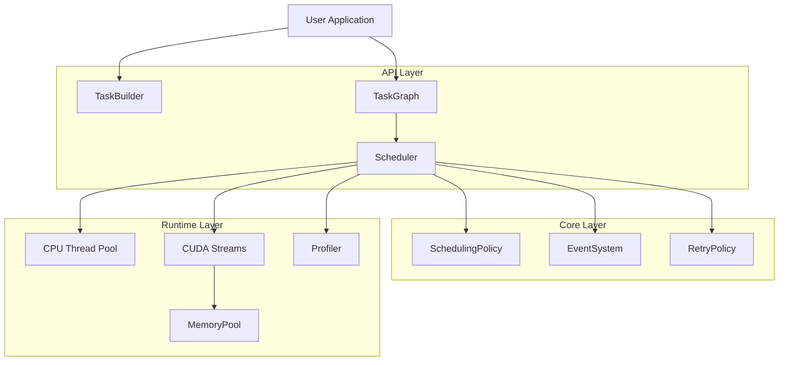

# Technical Whitepaper

> **HTS Architecture Deep Dive** — A comprehensive technical analysis of the Heterogeneous Task Scheduler

---

## Overview

This whitepaper section provides in-depth technical documentation for HTS, covering the core algorithms, data structures, and design decisions that make efficient heterogeneous computing possible.

## Papers

### 1. [DAG Scheduling](/en/whitepaper/dag-scheduling)

**Topics**: Task graph construction, topological sorting, cycle detection, dependency resolution

**Key Concepts**:
- Kahn's algorithm for topological sort
- Lock-free ready queue implementation
- Incremental dependency tracking

### 2. [Memory Management](/en/whitepaper/memory-management)

**Topics**: GPU memory pooling, buddy allocator, defragmentation strategies

**Key Concepts**:
- Buddy system allocator design
- Memory pool lifecycle
- Allocation overhead analysis

### 3. [Heterogeneous Execution](/en/whitepaper/heterogeneous-execution)

**Topics**: CPU/GPU dispatch, CUDA stream management, work stealing

**Key Concepts**:
- Device selection policies
- Stream priority management
- Cross-device synchronization

### 4. [Performance Analysis](/en/whitepaper/performance-analysis)

**Topics**: Profiling infrastructure, optimization strategies, benchmark methodology

**Key Concepts**:
- Timeline export (Chrome tracing)
- Critical path analysis
- Scalability considerations

---

## Architecture Overview

---

## Design Principles

### 1. Zero-Overhead Abstraction

HTS follows the C++ principle of "you don't pay for what you don't use":

- No virtual calls in hot paths (when not using polymorphic features)
- Compile-time device type selection when possible
- Inline functions for simple operations
- Template metaprogramming for type safety

### 2. Lock-Free Where Possible

Critical paths use lock-free data structures:

- Atomic operations for status updates
- Lock-free queues for ready tasks
- Compare-and-swap for state transitions

### 3. Error Resilience

- Comprehensive error codes (see `types.hpp`)
- Retry policies for transient failures
- Graceful degradation on errors
- Detailed error messages with context

---

## Target Audience

This whitepaper is intended for:

- **Library developers** extending HTS functionality
- **Performance engineers** optimizing HTS deployments
- **Researchers** studying task scheduling algorithms
- **Contributors** to the HTS codebase

---

## Prerequisites

- C++17 proficiency
- Understanding of DAG data structures
- Basic CUDA programming knowledge (for GPU sections)
- Familiarity with concurrent programming patterns

---

## Related Documentation

- [Architecture Guide](/en/guide/architecture) — High-level system overview
- [API Reference](/en/api/) — Complete API documentation
- [Benchmarks](/en/benchmarks/) — Performance measurements
