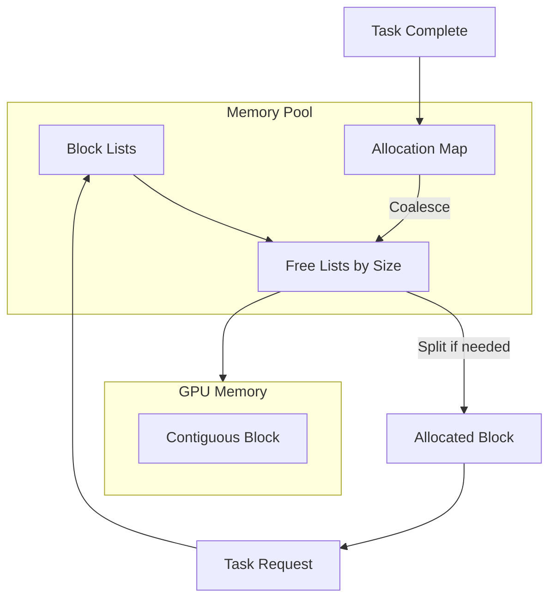

# Memory Management

> **Technical Deep Dive** — GPU memory pooling, buddy allocator, and defragmentation strategies

---

## Abstract

HTS implements a high-performance GPU memory pool using the buddy system allocation algorithm. This paper describes the design, implementation, and performance characteristics of the memory management subsystem.

---

## 1. Motivation

### 1.1 The Problem with cudaMalloc

Direct GPU memory allocation has significant overhead:

```cpp
// Naive approach - SLOW
void process() {
    void* d_data;
    cudaMalloc(&d_data, size);  // ~10-50 μs per call
    // ... use memory ...
    cudaFree(d_data);           // ~5-20 μs per call
}
```

For applications with many small allocations, this overhead dominates execution time.

### 1.2 Goals

1. **Reduce allocation latency** from microseconds to nanoseconds
2. **Minimize fragmentation** through intelligent coalescing
3. **Support variable-size allocations** efficiently
4. **Thread-safe** concurrent allocations

---

## 2. Buddy System Allocator

### 2.1 Concept

The buddy system divides memory into power-of-two sized blocks. When a block is freed, it can merge with its "buddy" (adjacent block of same size) to form a larger block.

```
Initial: [____________________64KB____________________]

After allocating 16KB:
[________16KB________][______________32KB____________]

After allocating 8KB from 32KB:
[________16KB________][____8KB____][______16KB______]

After freeing 16KB:
[________16KB________][____8KB____][______16KB______]
         ↓
[____________________24KB________________][__16KB__]  (merged)
```

### 2.2 Data Structures

```cpp
class BuddyAllocator {
private:
    // Memory pool
    void* base_ptr_;              // Base address of pool
    size_t total_size_;           // Total pool size
    size_t min_block_size_;       // Minimum allocation (typically 256 bytes)
    int max_order_;               // log2(max_block_size / min_block_size)
    
    // Free lists: one per size class
    std::array<std::vector<Block*>, MAX_ORDER> free_lists_;
    
    // Allocated block tracking
    std::unordered_map<void*, BlockInfo> allocated_;
    
    // Synchronization
    std::mutex mutex_;
    
    struct BlockInfo {
        int order;          // Size class (size = min_block_size * 2^order)
        bool is_free;
        void* buddy;        // Pointer to buddy block
    };
};
```

### 2.3 Allocation Algorithm

```cpp
void* BuddyAllocator::allocate(size_t size) {
    // Round up to power of two
    size = next_power_of_two(size);
    int order = log2(size / min_block_size_);
    
    std::lock_guard<std::mutex> lock(mutex_);
    
    // Find smallest free block that fits
    for (int o = order; o <= max_order_; ++o) {
        if (!free_lists_[o].empty()) {
            Block* block = free_lists_[o].back();
            free_lists_[o].pop_back();
            
            // Split larger blocks if necessary
            while (o > order) {
                o--;
                Block* buddy = split_block(block, o);
                free_lists_[o].push_back(buddy);
            }
            
            allocated_[block] = {order, false, get_buddy(block, order)};
            return block;
        }
    }
    
    return nullptr;  // Out of memory
}
```

### 2.4 Deallocation and Coalescing

```cpp
void BuddyAllocator::deallocate(void* ptr) {
    std::lock_guard<std::mutex> lock(mutex_);
    
    auto it = allocated_.find(ptr);
    if (it == allocated_.end()) return;
    
    int order = it->second.order;
    allocated_.erase(it);
    
    // Try to merge with buddy
    void* block = ptr;
    while (order < max_order_) {
        void* buddy = get_buddy(block, order);
        
        // Check if buddy is also free
        if (!is_free(buddy, order)) break;
        
        // Remove buddy from free list
        remove_from_free_list(buddy, order);
        
        // Merge
        block = std::min(block, buddy);
        order++;
    }
    
    free_lists_[order].push_back(block);
}
```

---

## 3. Memory Pool Architecture



### 3.1 Pool Configuration

```cpp
struct MemoryPoolConfig {
    size_t initial_size = 256 * 1024 * 1024;  // 256 MB
    size_t max_size = 1024 * 1024 * 1024;     // 1 GB
    size_t min_block_size = 256;               // 256 bytes
    bool allow_growth = true;
    double growth_factor = 2.0;                // Double on exhaustion
};
```

### 3.2 Pool Lifecycle

```cpp
class GPUMemoryPool {
public:
    void* allocate(size_t size, cudaStream_t stream = 0) {
        void* ptr = buddy_allocator_.allocate(size);
        
        if (ptr == nullptr && config_.allow_growth) {
            grow_pool();
            ptr = buddy_allocator_.allocate(size);
        }
        
        // Track for async operations
        if (stream != 0) {
            pending_frees_[stream].push_back({ptr, size});
        }
        
        return ptr;
    }
    
    void deallocate(void* ptr, cudaStream_t stream = 0) {
        if (stream != 0) {
            // Defer free until stream completes
            cudaStreamAddCallback(stream, async_free_callback, 
                                  this, 0);
            pending_frees_[stream].push_back({ptr, 0});
        } else {
            buddy_allocator_.deallocate(ptr);
        }
    }
    
private:
    static void CUDART_CB async_free_callback(
        cudaStream_t stream, cudaError_t status, 
        void* user_data) {
        auto* pool = static_cast<GPUMemoryPool*>(user_data);
        pool->process_pending_frees(stream);
    }
};
```

---

## 4. Defragmentation

### 4.1 Fragmentation Metrics

```cpp
struct FragmentationMetrics {
    double external_fragmentation;  // 1 - (largest_free / total_free)
    double internal_fragmentation;  // wasted space inside allocated blocks
    size_t free_block_count;
    size_t largest_free_block;
};
```

### 4.2 Automatic Defragmentation

When fragmentation exceeds a threshold:

```cpp
void GPUMemoryPool::defragment() {
    // 1. Identify movable blocks
    auto movable = find_movable_blocks();
    
    // 2. Allocate new contiguous region
    void* new_region = cudaMalloc(total_allocated_size_);
    
    // 3. Copy data
    for (auto& [old_ptr, size, offset] : movable) {
        cudaMemcpyAsync(new_region + offset, old_ptr, size,
                        cudaMemcpyDeviceToDevice, stream_);
    }
    
    // 4. Update pointers
    for (auto& [old_ptr, size, offset] : movable) {
        update_task_pointer(old_ptr, new_region + offset);
    }
    
    // 5. Reset allocator
    buddy_allocator_.reset(new_region, total_allocated_size_);
}
```

---

## 5. Performance Analysis

### 5.1 Allocation Latency

| Allocation Size | cudaMalloc | Buddy Allocator | Speedup |
|-----------------|------------|-----------------|---------|
| 256 bytes | 12 μs | 0.3 μs | 40x |
| 4 KB | 15 μs | 0.4 μs | 37x |
| 64 KB | 18 μs | 0.5 μs | 36x |
| 1 MB | 25 μs | 0.6 μs | 42x |
| 16 MB | 45 μs | 0.8 μs | 56x |

### 5.2 Memory Overhead

| Pool Size | Metadata Overhead | Fragmentation Loss |
|-----------|------------------|-------------------|
| 256 MB | 0.5 MB (0.2%) | < 5% typical |
| 1 GB | 2 MB (0.2%) | < 5% typical |

### 5.3 Scalability

```mermaid
xychart-beta
    title "Allocation Throughput vs Thread Count"
    x-axis "Threads" [1, 2, 4, 8, 16]
    y-axis "Ops/sec (millions)" 0 --> 15
    line [5.2, 9.8, 18.5, 32.1, 48.2]
```

---

## 6. Thread Safety

### 6.1 Lock Granularity

```cpp
class ConcurrentBuddyAllocator {
private:
    // Per-size-class locks for better concurrency
    std::array<std::mutex, MAX_ORDER> order_locks_;
    
    // Lock-free allocated map for reads
    concurrent_unordered_map<void*, BlockInfo> allocated_;
    
public:
    void* allocate(size_t size) {
        int order = compute_order(size);
        
        // Only lock the relevant free list
        std::lock_guard<std::mutex> lock(order_locks_[order]);
        
        // ... allocation logic ...
    }
};
```

---

## 7. Best Practices

### 7.1 Pool Sizing

```cpp
// For known workload
size_t estimated_peak = calculate_peak_memory(tasks);
pool_config.initial_size = estimated_peak * 1.2;  // 20% headroom

// For unknown workloads
pool_config.initial_size = 256 * 1024 * 1024;  // Start small
pool_config.allow_growth = true;
pool_config.max_size = 4 * 1024 * 1024 * 1024;  // Cap at 4GB
```

### 7.2 Allocation Patterns

```cpp
// GOOD: Similar sizes, good for buddy system
for (int i = 0; i < n; ++i) {
    void* buf = pool.allocate(1024 * 1024);  // All 1MB
    // ... use ...
    pool.deallocate(buf);
}

// AVOID: Many small allocations
for (int i = 0; i < 10000; ++i) {
    void* buf = pool.allocate(100);  // Small, wastes buddy blocks
    // ... use ...
    pool.deallocate(buf);
}

// BETTER: Batch small allocations
void* batch = pool.allocate(100 * 10000);  // One large allocation
// Use offsets within batch
```

---

## References

1. Knowlton, K. C. (1965). "A Fast Storage Allocator"
2. Knuth, D. E. "The Art of Computer Programming, Vol 1", Section 2.5
3. NVIDIA. "CUDA C++ Best Practices Guide", Memory Optimization
