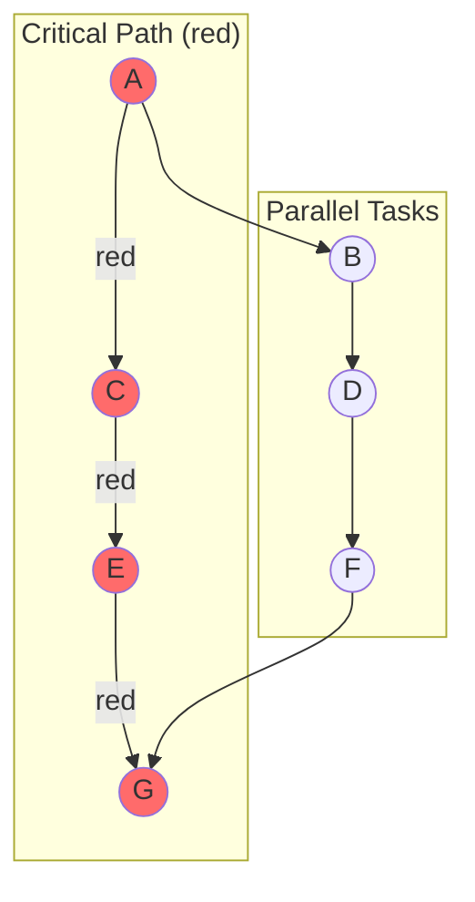

# Performance Analysis

> **Technical Deep Dive** — Profiling infrastructure, optimization strategies, and benchmark methodology

---

## Abstract

HTS includes comprehensive profiling infrastructure for understanding scheduler behavior and identifying performance bottlenecks. This paper describes the profiling architecture, analysis techniques, and optimization strategies.

---

## 1. Profiling Architecture

### 1.1 Data Collection

```cpp
class Profiler {
private:
    struct TaskRecord {
        TaskId id;
        std::string name;
        DeviceType device;
        TaskPriority priority;
        
        // Timing
        std::chrono::nanoseconds created_time;
        std::chrono::nanoseconds started_time;
        std::chrono::nanoseconds completed_time;
        
        // Dependencies
        std::vector<TaskId> predecessors;
        std::vector<TaskId> successors;
    };
    
    std::vector<TaskRecord> records_;
    std::chrono::steady_clock::time_point start_time_;
    
public:
    void record_task_created(const Task& task) {
        TaskRecord record;
        record.id = task.id();
        record.name = task.name();
        record.device = task.device_type();
        record.priority = task.priority();
        record.created_time = now();
        records_.push_back(record);
    }
    
    void record_task_started(TaskId id) {
        auto& record = find_record(id);
        record.started_time = now();
    }
    
    void record_task_completed(TaskId id) {
        auto& record = find_record(id);
        record.completed_time = now();
    }
};
```

### 1.2 Metrics Computed

| Metric | Formula | Interpretation |
|--------|---------|----------------|
| **Task Time** | `completed - started` | Actual execution time |
| **Wait Time** | `started - created` | Time waiting for dependencies |
| **Critical Path** | Longest path through DAG | Lower bound on execution time |
| **Parallelism** | `Σ(task_time) / wall_time` | Average concurrent tasks |
| **CPU Utilization** | `cpu_task_time / (wall_time × threads)` | CPU efficiency |
| **GPU Utilization** | `gpu_task_time / (wall_time × streams)` | GPU efficiency |

---

## 2. Timeline Export

### 2.1 Chrome Tracing Format

HTS exports timelines compatible with Chrome's `about:tracing` viewer:

```json
{
  "traceEvents": [
    {
      "name": "TaskA",
      "cat": "CPU",
      "ph": "B",
      "ts": 1000,
      "pid": 1,
      "tid": 1
    },
    {
      "name": "TaskA",
      "cat": "CPU",
      "ph": "E",
      "ts": 2500,
      "pid": 1,
      "tid": 1
    }
  ]
}
```

### 2.2 Export Implementation

```cpp
void Profiler::export_chrome_tracing(const std::string& filename) const {
    std::ofstream file(filename);
    file << "{\"traceEvents\":[\n";
    
    bool first = true;
    for (const auto& record : records_) {
        auto start_us = std::chrono::duration_cast<
            std::chrono::microseconds>(
            record.started_time).count();
        auto end_us = std::chrono::duration_cast<
            std::chrono::microseconds>(
            record.completed_time).count();
        
        // Begin event
        file << (first ? "" : ",\n");
        file << "  {\"name\":\"" << record.name << "\","
             << "\"cat\":\"" << device_name(record.device) << "\","
             << "\"ph\":\"B\","
             << "\"ts\":" << start_us << ","
             << "\"pid\":" << pid_for_device(record.device) << ","
             << "\"tid\":" << tid_for_task(record) << "}";
        
        // End event
        file << ",\n"
             << "  {\"name\":\"" << record.name << "\","
             << "\"cat\":\"" << device_name(record.device) << "\","
             << "\"ph\":\"E\","
             << "\"ts\":" << end_us << ","
             << "\"pid\":" << pid_for_device(record.device) << ","
             << "\"tid\":" << tid_for_task(record) << "}";
        
        first = false;
    }
    
    file << "\n]}";
}
```

### 2.3 Timeline Visualization

```
Timeline View (Chrome Tracing):
┌────────────────────────────────────────────────────────────┐
│ CPU Thread 1 │████████│      │████████████│                │
│ CPU Thread 2 │        │██████│            │████████████│    │
│ GPU Stream 0 │        │████████████████████│            │    │
│ GPU Stream 1 │        │                  │████████████│    │
└────────────────────────────────────────────────────────────┘
               0ms     10ms   20ms         40ms         60ms
```

---

## 3. Critical Path Analysis

### 3.1 Algorithm

```cpp
struct CriticalPathResult {
    std::vector<TaskId> path;
    std::chrono::nanoseconds duration;
};

CriticalPathResult Profiler::find_critical_path() const {
    // Compute earliest completion time for each task
    std::unordered_map<TaskId, std::chrono::nanoseconds> ect;
    
    // Topological order
    auto order = topological_order();
    
    for (TaskId id : order) {
        const auto& record = find_record(id);
        
        // Latest predecessor completion
        auto max_pred_completion = std::chrono::nanoseconds(0);
        for (TaskId pred : record.predecessors) {
            max_pred_completion = std::max(
                max_pred_completion, 
                ect[pred]
            );
        }
        
        // Task's own duration
        auto duration = record.completed_time - record.started_time;
        
        // Earliest completion time
        ect[id] = max_pred_completion + duration;
    }
    
    // Find task with maximum ECT
    TaskId end_task = find_max_ect(ect);
    
    // Backtrack to find path
    std::vector<TaskId> path;
    TaskId current = end_task;
    while (current != INVALID_TASK_ID) {
        path.push_back(current);
        current = find_critical_predecessor(current, ect);
    }
    
    std::reverse(path.begin(), path.end());
    
    return {path, ect[end_task]};
}
```

### 3.2 Optimization Insight



**Insight**: Optimizing tasks B, D, F won't reduce total time. Focus on A, C, E, G.

---

## 4. Bottleneck Detection

### 4.1 Device Imbalance

```cpp
struct ImbalanceReport {
    double cpu_idle_ratio;
    double gpu_idle_ratio;
    std::string recommendation;
};

ImbalanceReport Profiler::analyze_device_balance() const {
    auto total_time = total_execution_time();
    auto cpu_time = total_cpu_task_time();
    auto gpu_time = total_gpu_task_time();
    
    auto cpu_capacity = total_time * cpu_thread_count_;
    auto gpu_capacity = total_time * gpu_stream_count_;
    
    double cpu_idle = 1.0 - (cpu_time.count() / (double)cpu_capacity.count());
    double gpu_idle = 1.0 - (gpu_time.count() / (double)gpu_capacity.count());
    
    std::string rec;
    if (cpu_idle > 0.3 && gpu_idle < 0.1) {
        rec = "CPU underutilized. Consider offloading GPU tasks to CPU.";
    } else if (gpu_idle > 0.3 && cpu_idle < 0.1) {
        rec = "GPU underutilized. Consider more GPU tasks.";
    }
    
    return {cpu_idle, gpu_idle, rec};
}
```

### 4.2 Dependency Bottlenecks

```cpp
struct DependencyHotspot {
    TaskId task;
    int blocked_count;  // Number of tasks waiting on this
    std::chrono::nanoseconds total_wait_time;
};

std::vector<DependencyHotspot> Profiler::find_dependency_hotspots() const {
    std::unordered_map<TaskId, int> blocked_count;
    std::unordered_map<TaskId, std::chrono::nanoseconds> wait_time;
    
    for (const auto& record : records_) {
        auto task_wait = record.started_time - record.created_time;
        
        for (TaskId pred : record.predecessors) {
            blocked_count[pred]++;
            wait_time[pred] += task_wait / record.predecessors.size();
        }
    }
    
    std::vector<DependencyHotspot> hotspots;
    for (auto& [id, count] : blocked_count) {
        hotspots.push_back({id, count, wait_time[id]});
    }
    
    std::sort(hotspots.begin(), hotspots.end(),
        [](const auto& a, const auto& b) {
            return a.total_wait_time > b.total_wait_time;
        });
    
    return hotspots;
}
```

---

## 5. Optimization Strategies

### 5.1 Task Graph Restructuring

**Problem**: Sequential bottleneck

```cpp
// Before: A → B → C → D (all sequential)
auto a = graph.add_task(DeviceType::CPU);
auto b = graph.add_task(DeviceType::CPU);
auto c = graph.add_task(DeviceType::CPU);
auto d = graph.add_task(DeviceType::CPU);
graph.add_dependency(a, b);
graph.add_dependency(b, c);
graph.add_dependency(c, d);
```

**Solution**: Introduce parallelism

```cpp
// After: A → [B, C] → D (B and C parallel)
auto a = graph.add_task(DeviceType::CPU);
auto b = graph.add_task(DeviceType::CPU);
auto c = graph.add_task(DeviceType::CPU);
auto d = graph.add_task(DeviceType::CPU);
graph.add_dependency(a, b);
graph.add_dependency(a, c);  // B and C now parallel
graph.add_dependency(b, d);
graph.add_dependency(c, d);
```

### 5.2 Device Selection Tuning

```cpp
// Analyze task characteristics
for (const auto& record : records_) {
    auto cpu_time = record.cpu_execution_time;
    auto gpu_time = record.gpu_execution_time;
    
    double speedup = cpu_time.count() / (double)gpu_time.count();
    
    if (speedup > 10.0 && record.device == DeviceType::CPU) {
        std::cout << "Task " << record.name 
                  << " would benefit from GPU execution\n";
    }
}
```

### 5.3 Memory Transfer Optimization

```cpp
// Profile memory transfers
struct TransferStats {
    size_t total_bytes;
    int transfer_count;
    double avg_size;
};

TransferStats Profiler::analyze_transfers() const {
    // Identify small transfers that could be batched
    // Identify pinned vs pageable memory usage
    // Calculate transfer overhead percentage
}
```

---

## 6. Benchmark Methodology

### 6.1 Controlled Environment

```cpp
struct BenchmarkConfig {
    int warmup_iterations = 5;
    int measurement_iterations = 100;
    bool pin_to_cpu = true;
    bool set_realtime_priority = false;
    std::vector<int> cpu_affinity;
};
```

### 6.2 Statistical Analysis

```cpp
struct BenchmarkResult {
    double mean;
    double median;
    double stddev;
    double min;
    double max;
    double p5;
    double p95;
};

BenchmarkResult compute_statistics(std::vector<double> samples) {
    std::sort(samples.begin(), samples.end());
    
    double sum = std::accumulate(samples.begin(), samples.end(), 0.0);
    double mean = sum / samples.size();
    
    double sq_sum = std::inner_product(
        samples.begin(), samples.end(), 
        samples.begin(), 0.0);
    double stddev = std::sqrt(sq_sum / samples.size() - mean * mean);
    
    return {
        mean,
        samples[samples.size() / 2],
        stddev,
        samples.front(),
        samples.back(),
        samples[samples.size() * 0.05],
        samples[samples.size() * 0.95]
    };
}
```

### 6.3 Scaling Tests

```cpp
void run_scaling_benchmark() {
    std::vector<int> thread_counts = {1, 2, 4, 8, 16, 32};
    
    for (int threads : thread_counts) {
        SchedulerConfig config;
        config.cpu_thread_count = threads;
        
        auto result = benchmark_with_config(config);
        
        double speedup = result.baseline_time / result.time;
        double efficiency = speedup / threads;
        
        std::cout << threads << " threads: "
                  << result.time << " ms, "
                  << "speedup=" << speedup << "x, "
                  << "efficiency=" << (efficiency * 100) << "%\n";
    }
}
```

---

## 7. Interpreting Results

### 7.1 Good Parallelism

```
Tasks: 100
Wall time: 100 ms
Total task time: 800 ms (sum of all task times)
Parallelism: 800 / 100 = 8.0x

Interpretation: Good - 8 tasks running concurrently on average
```

### 7.2 Poor Parallelism

```
Tasks: 100
Wall time: 800 ms
Total task time: 850 ms
Parallelism: 850 / 800 = 1.06x

Interpretation: Poor - Nearly sequential execution
Action: Review dependency graph, enable more parallelism
```

### 7.3 Critical Path Analysis

```
Critical path length: 200 ms
Actual execution time: 250 ms

Ratio: 250 / 200 = 1.25

Interpretation: Close to optimal (1.0)
Overhead from scheduling and synchronization: 25%
```

---

## References

1. Abramson, D. et al. "Performance Analysis and Visualization"
2. NVIDIA Nsight Systems Documentation
3. Chrome Tracing Format Specification
