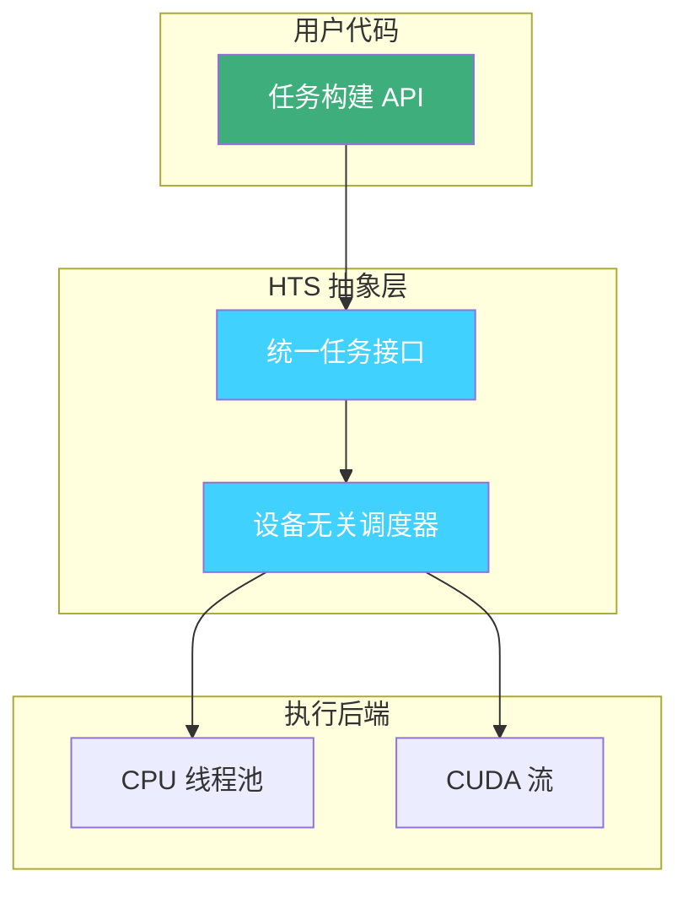
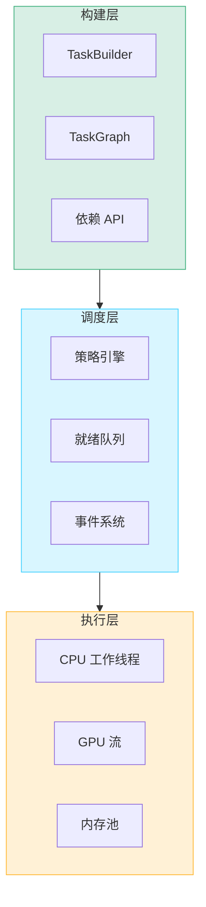
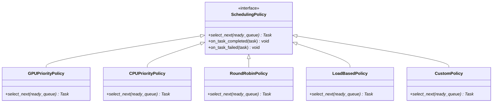
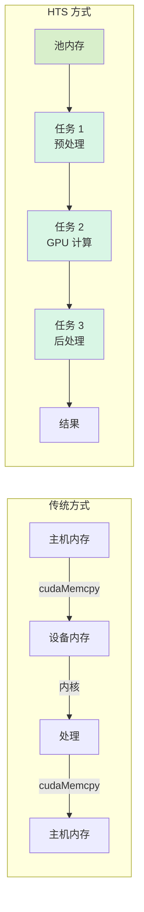

# 设计哲学

本文档解释 HTS 背后的核心设计决策和架构哲学。

## 异构计算的统一抽象

### 为什么选择统一 API？

HTS 采用单一、一致的 API 设计，抽象掉异构计算的复杂性：



**核心优势：**

- **单一思维模型**：开发者只需思考任务和依赖关系，无需关心设备特定代码
- **可移植性**：相同代码可在仅 CPU 或 CPU+GPU 系统上运行
- **可维护性**：执行后端的变更不影响用户代码

### CPU/GPU 任务抽象

CPU 和 GPU 任务共享相同的接口：

```cpp
// CPU 任务
auto cpu_task = builder
    .create_task("Preprocess")
    .device(DeviceType::CPU)
    .cpu_func([](TaskContext& ctx) { /* ... */ })
    .build();

// GPU 任务 - 相同模式，不同设备
auto gpu_task = builder
    .create_task("Compute")
    .device(DeviceType::GPU)
    .gpu_func([](TaskContext& ctx, cudaStream_t stream) { /* ... */ })
    .build();

// 依赖关系工作方式完全相同
graph.add_dependency(cpu_task->id(), gpu_task->id());
```

### 零学习成本的迁移体验

设计原则：**如果你会写函数，你就会写任务。**

- 无需学习新的编程范式
- 无需 DSL（领域特定语言）
- 标准 C++ lambda 和函数对象
- 渐进式采用：从一个任务开始，逐步扩展到 DAG

---

## DAG-First 架构

### 分层设计动机

HTS 采用三层架构，DAG 是核心概念：



### 各层职责边界

| 层级 | 职责 | 核心类 |
|------|------|--------|
| **构建层** | DAG 构建、验证、任务配置 | `TaskBuilder`, `TaskGraph` |
| **调度层** | 依赖解析、任务选择、状态管理 | `Scheduler`, `SchedulingPolicy` |
| **执行层** | 任务分发、资源管理、内存池化 | `ExecutionEngine`, `MemoryPool` |

### 为什么以 DAG 为中心？

1. **自然表达真实工作负载**：大多数计算流水线具有内在依赖关系
2. **自动并行化**：独立任务自动并行执行，无需显式线程管理
3. **错误传播**：失败沿依赖边自然传播
4. **优化机会**：DAG 结构支持静态分析和调度优化

### 清晰的层边界

每一层都有单一职责：

```cpp
// 构建层：定义执行"什么"
TaskGraph graph;
TaskBuilder builder(graph);
auto task = builder.name("MyTask").cpu(my_func).build();

// 调度层：决定"何时"和"何地"执行
Scheduler scheduler;
scheduler.set_policy(std::make_unique<GPUPriorityPolicy>());
scheduler.init(&graph);

// 执行层：执行"如何"
scheduler.execute();  // 内部处理
```

---

## 可插拔调度策略

### 策略模式的应用

调度策略使用策略模式实现：



### 开闭原则的实践

调度器**对扩展开放，对修改封闭**：

```cpp
// 内置策略开箱即用
scheduler.set_policy(std::make_unique<GPUPriorityPolicy>());

// 自定义策略扩展无需修改核心代码
class MyCustomPolicy : public SchedulingPolicy {
public:
    Task* select_next(std::vector<Task*>& ready_queue) override {
        // 你的自定义逻辑
        return /* ... */;
    }
};

scheduler.set_policy(std::make_unique<MyCustomPolicy>());
```

### 扩展点

HTS 提供清晰的扩展点用于自定义：

| 扩展点 | 基类 | 用途 |
|--------|------|------|
| 调度策略 | `SchedulingPolicy` | 控制任务选择顺序 |
| 重试策略 | `RetryPolicy` | 自定义失败恢复 |
| 内存分配器 | `MemoryPool` | 自定义分配策略 |
| 事件钩子 | `EventHandler` | 观察执行生命周期 |

---

## 内存管理考量

### 零拷贝设计原则

HTS 最小化不必要的数据移动：



**关键设计决策：**

- 内存在 GPU 任务链中保持在设备上
- 池分配消除 `cudaMalloc`/`cudaFree` 开销
- 任务间数据通过 `TaskContext` 传递

### 为什么选择伙伴系统？

选择伙伴系统分配器有特定原因：

| 需求 | 伙伴系统 | 替代方案：Slab 分配器 |
|------|----------|------------------------|
| 可变大小分配 | ✅ 优秀 | ❌ 仅支持固定大小 |
| O(log n) 分配 | ✅ 是 | ✅ 固定大小 O(1) |
| 碎片整理 | ✅ 内置合并 | ❌ 需手动管理 |
| 内存效率 | ⚠️ ~25% 内部碎片 | ✅ 最小碎片 |

**决策理由：**

1. **工作负载特征**：HTS 任务请求不同大小的内存
2. **简单性**：伙伴系统更容易正确实现
3. **可预测性能**：O(log n) 最坏情况，无碎片尖峰
4. **碎片整理**：自然合并减少手动干预

### GPU 内存池特殊处理

GPU 内存有独特约束，影响了设计：

```cpp
// 内存池处理 GPU 特定问题：
MemoryPoolConfig config;
config.pool_size_mb = 4096;           // 预分配，避免 cudaMalloc
config.min_block_size_kb = 4;         // 对齐 CUDA 要求
config.enable_defragmentation = true; // 自动合并伙伴块

// 任务作用域分配确保正确清理
task->set_gpu_function([](TaskContext& ctx, cudaStream_t stream) {
    void* ptr = ctx.allocate_gpu(size);  // 从池分配，非 cudaMalloc
    // ... 使用内存 ...
    // 任务完成时自动归还池
});
```

---

## 设计权衡

### 显式 vs 隐式

HTS 在多个方面选择**显式优于隐式**：

| 特性 | HTS 方式 | 替代方案 |
|------|----------|----------|
| 设备选择 | `DeviceType::CPU` 或 `DeviceType::GPU` | 基于代码自动检测 |
| 依赖关系 | `graph.add_dependency(a, b)` | 从数据流推断 |
| 内存生命周期 | 任务作用域 | 垃圾回收 |

**理由**：显式声明带来：
- 更好的错误消息
- 更可预测的行为
- 更容易调试
- 静态分析机会

### 抽象 vs 控制

HTS 提供**高层抽象，同时提供逃生舱**：

```cpp
// 高层：让 HTS 管理一切
auto task = builder.name("Compute").gpu(my_kernel).build();

// 底层：需要时直接控制
task->set_gpu_function([](TaskContext& ctx, cudaStream_t stream) {
    // 完全访问 CUDA 流、内存池等
    cudaStreamAttrValue attr;
    attr.accessPolicyWindow.base_ptr = /* ... */;
    cudaStreamSetAttribute(stream, cudaStreamAttributeAccessPolicyWindow, &attr);
});
```

### 安全 vs 性能

HTS 默认**安全优先，性能需显式选择**：

| 默认行为 | 可选优化 |
|----------|----------|
| 完整依赖验证 | 跳过验证 |
| 任务级内存隔离 | 共享内存池 |
| 全面错误检查 | 最小开销模式 |

---

## 影响与启发

HTS 设计受以下项目影响：

- **任务图框架**：Intel TBB、OpenMP tasks、StarPU
- **DAG 系统**：Apache Airflow、Luigi、Dagster
- **内存池**：jemalloc、CUDA memory pools
- **调度理论**：操作系统调度器、HPC 调度器

---

## 总结

HTS 的设计哲学可概括为：

1. **简单优先**：统一 API，最少概念学习
2. **DAG 为中心**：依赖驱动一切
3. **可扩展性**：策略模式，清晰扩展点
4. **高效性**：零拷贝、池化内存、O(log n) 操作
5. **显式性**：清晰控制、可预测行为

这些原则指导 HTS 的所有设计决策，从高层架构到底层实现细节。
