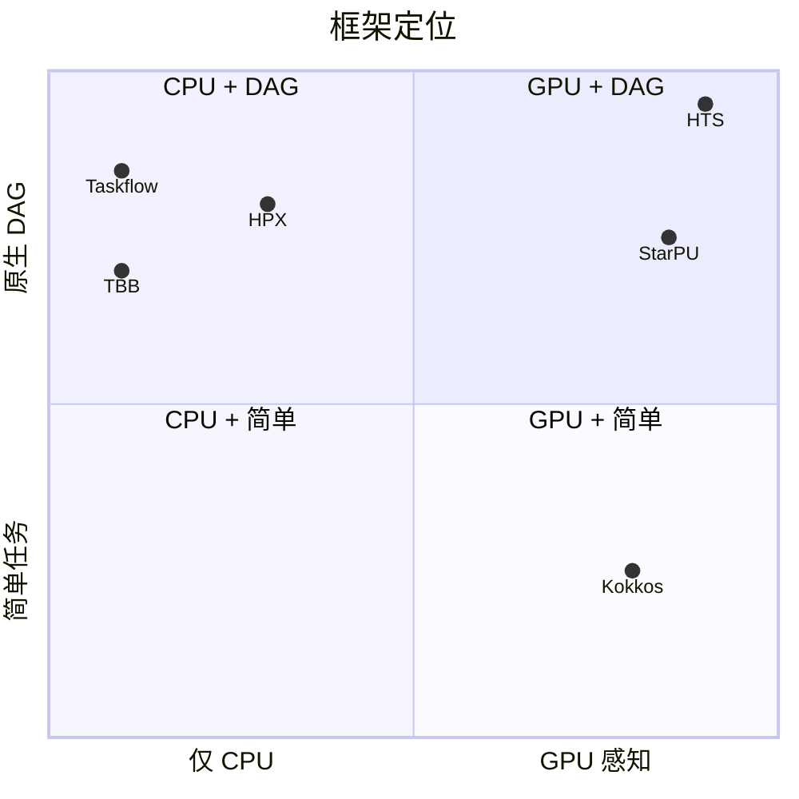
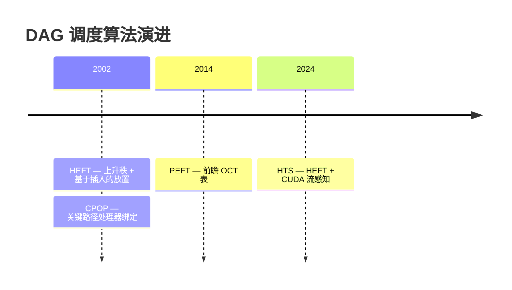

# 相关工作

本页面调研了指导 HTS（异构任务调度器）设计的理论基础、调度算法、内存管理技术和 GPU 编程实践。

## 任务调度框架

下表对比了 HTS 与其他主流任务调度框架在关键维度上的差异。

| 框架 | 语言 | GPU 支持 | DAG 支持 | 许可证 |
|-----|------|---------|---------|-------|
| **HTS** | C++17 | CUDA | 原生 | MIT |
| StarPU | C | CUDA / OpenCL | 是 | LGPL |
| Kokkos | C++ | CUDA / HIP | 否 | BSD |
| HPX | C++ | 有限 | 是 | Boost |
| TBB | C++ | 否 | 是 | Apache |
| Taskflow | C++17 | 否 | 是 | MIT |

### 对比说明

- **HTS** 通过在异构 CPU + GPU 系统上的原生 DAG 调度脱颖而出，结合了基于 HEFT 的优先级策略和 CUDA 流感知执行。
- **StarPU** [Augonnet et al., 2011] 提供最广泛的加速器支持（CUDA、OpenCL）和成熟的运行时，但依赖 C 代码库，LGPL 许可证可能限制采用。
- **Kokkos** [Edwards et al., 2014] 在跨 GPU 厂商的性能可移植性方面表现优异，但不提供任务 DAG 调度器；主要是一个并行编程模型。
- **HPX** [Kaiser et al., 2009] 实现了 ParalleX 运行时，具有细粒度任务调度，但 GPU 支持仍处于实验阶段。
- **TBB** [Reinders, 2007] 提供稳健的 CPU 任务调度和依赖图，但完全缺乏 GPU 感知。
- **Taskflow** [Huang et al., 2022] 与 HTS 共享 C++17 基线和 MIT 许可证，提供富有表现力的 DAG 组合，但针对仅 CPU 执行。



## 理论基础

HTS 借鉴了三十年来异构系统 DAG 调度的研究成果。

### HEFT 算法

**异构最早完成时间** — Topcuoglu, Hariri 和 Wu [2002]。

HEFT 是一种两阶段列表调度启发式算法：

1. **优先级排序** — 为每个任务 $v_i$ 计算*上升秩* $rank_u(v_i)$：

$$rank_u(v_i) = \overline{w_i} + \max_{v_j \in succ(v_i)} \left( \overline{c_{i,j}} + rank_u(v_j) \right)$$

   其中 $\overline{w_i}$ 是平均计算成本，$\overline{c_{i,j}}$ 是边 $(v_i, v_j)$ 上的平均通信成本。任务按上升秩降序调度。

2. **处理器选择** — 每个任务放置在产生最早完成时间的处理器上，将任务插入最早的空闲槽（基于插入的策略）。

HEFT 对异构处理器上的任意 DAG 实现接近最优的完工时间，是 HTS 优先级队列的算法基础。

### CPOP 算法

**处理器上的关键路径** — Topcuoglu, Hariri 和 Wu [2002]。

CPOP 识别 DAG 的关键路径，并将所有关键路径任务调度到最小化总关键路径成本的单一处理器上。非关键任务使用最早完成时间策略在剩余处理器上调度。

- **优势**：保证关键路径不产生处理器间通信。
- **局限**：当关键路径长而窄时，可能无法充分利用可用并行性。

### PEFT 算法

**预测最早完成时间** — Arabnejad 和 Barbosa [2014]。

PEFT 通过引入*乐观成本表*（OCT）改进 HEFT，该表预先计算每个任务在每个处理器上的最早完成时间，假设所有前驱任务在最早可能时间完成。这种前瞻机制在不增加调度复杂度的情况下实现更好的处理器选择。

- **时间复杂度**：$O(v^2 \times p)$，与 HEFT 相同，其中 $v$ 是任务数，$p$ 是处理器数。
- **相比 HEFT 的改进**：在基准 DAG 上通常减少 5-15% 的完工时间。



## 内存池设计参考

HTS 采用 Buddy 系统内存池进行高效的 GPU 端分配。设计参考了经典的内存管理研究。

### Buddy 系统

**Knowlton [1965]** — 基于二分拆分的快速存储分配器。

关键特性：

| 属性 | 值 | 说明 |
|-----|-----|-----|
| 分配成本 | $O(\log n)$ | 递归拆分更大的块 |
| 释放成本 | $O(\log n)$ | 递归合并相邻伙伴 |
| 内部碎片 | $\le 50\%$ | 最坏情况：请求 $2^k + 1$，块为 $2^{k+1}$ |
| 外部碎片 | 无 | 任何空闲块都可拆分满足请求 |

HTS 将 Buddy 系统适配到 CUDA 设备内存，其中 `cudaMalloc` / `cudaFree` 调用由于驱动程序开销而昂贵。池化在许多小任务数据分配间摊销这些成本。

### 相关内存策略

- **Slab 分配** [Bonwick, 1994] — Linux 内核中使用的对象缓存分配器。对固定大小对象优于 Buddy，但对可变大小 GPU 缓冲区灵活性较差。
- **基于区域的分配** [Tofte & Talpin, 1997] — 区域中的所有分配一起释放。用于 HTS 的每 DAG 暂存空间，在 DAG 完成时回收。

## CUDA 流管理最佳实践

HTS 利用 CUDA 流实现跨多 GPU 和单 GPU 内的并发内核执行。设计遵循 NVIDIA 推荐的实践。

### 多流并发

CUDA 流支持内核执行、数据传输和主机端计算的重叠：

```mermaid
gantt
    title CUDA 流并发
    dateFormat X
    axisFormat %s

    section 流 0
    H2D 传输  :s0_h2d, 0, 2
    内核 A    :s0_kern, 2, 5
    D2H 传输  :s0_d2h, 5, 7

    section 流 1
    H2D 传输  :s1_h2d, 1, 3
    内核 B    :s1_kern, 3, 6
    D2H 传输  :s1_d2h, 6, 8

    section 流 2
    H2D 传输  :s2_h2d, 2, 4
    内核 C    :s2_kern, 4, 7
```



HTS 默认为每个任务分配一个 CUDA 流，通过 CUDA 事件而非全局同步解决任务间依赖。

### 事件同步

CUDA 事件提供轻量级的流间同步：

```cpp
// 记录生产者任务完成
cudaEventRecord(producer_done, producer_stream);

// 消费者流等待生产者
cudaStreamWaitEvent(consumer_stream, producer_done, 0);
```

这种模式用细粒度依赖替代 `cudaDeviceSynchronize()`，允许独立流继续执行而不停顿。

### 关键准则

1. **避免默认流** — 默认流（流 0）中的操作在 CUDA 7 之前的硬件上会序列化所有流。
2. **池化流** — 创建和销毁流的成本很高。HTS 维护跨 DAG 执行回收的流池。
3. **最小化主机-设备同步** — 尽可能使用事件和回调代替 `cudaStreamSynchronize()`。
4. **遵守并发限制** — GPU 有有限的 SM 数；启动过多并发内核可能因资源争用降低性能。

## 参考文献

1. Arabnejad, H. and Barbosa, J.G. (2014). List scheduling algorithm for heterogeneous systems by an optimistic cost table. *Journal of Parallel and Distributed Computing*, 74(10), 2959--2973. https://doi.org/10.1016/j.jpdc.2014.06.007

2. Augonnet, C., Thibault, S., Namyst, R., and Wacrenier, P.-A. (2011). StarPU: A unified platform for task scheduling on heterogeneous multicore architectures. *Concurrency and Computation: Practice and Experience*, 23(2), 187--198. https://doi.org/10.1002/cpe.1631

3. Bonwick, J. (1994). The slab allocator: An object-caching kernel memory allocator. In *Proceedings of the USENIX Summer Technical Conference*.

4. Edwards, H.C., Trott, C.R., and Sunderland, D. (2014). Kokkos: Enabling manycore performance portability through an abstract programming model. *International Journal of High Performance Computing Applications*, 28(4), 420--434. https://doi.org/10.1177/1094342014528137

5. Huang, C.-H., Langer, M., and Kuhweide, D. (2022). Cpp-Taskflow: A general-purpose parallel task programming system at scale. *IEEE Transactions on Parallel and Distributed Systems*, 33(6), 1407--1419. https://doi.org/10.1109/TPDS.2021.3122995

6. Kaiser, H., Brodowicz, M., and Sterling, T. (2009). ParalleX: An advanced parallel execution model for scaling-impaired applications. In *Proceedings of the International Conference on Parallel Processing Workshops*.

7. Knowlton, K.C. (1965). A fast storage allocator. *Communications of the ACM*, 8(10), 623--624. https://doi.org/10.1145/365628.365655

8. NVIDIA Corporation (2025). *CUDA C++ Programming Guide*, v12.8. https://docs.nvidia.com/cuda/cuda-c-programming-guide/

9. Reinders, J. (2007). *Intel Threading Building Blocks: Outfitting C++ for Multi-core Processor Parallelism*. O'Reilly Media.

10. Tofte, M. and Talpin, J.-P. (1997). Region-based memory management. *Information and Computation*, 132(2), 109--176. https://doi.org/10.1006/inco.1996.2613

11. Topcuoglu, H., Hariri, S., and Wu, M.-Y. (2002). Performance-effective and low-complexity task scheduling for heterogeneous computing. *IEEE Transactions on Parallel and Distributed Systems*, 13(3), 260--274. https://doi.org/10.1109/71.993206
