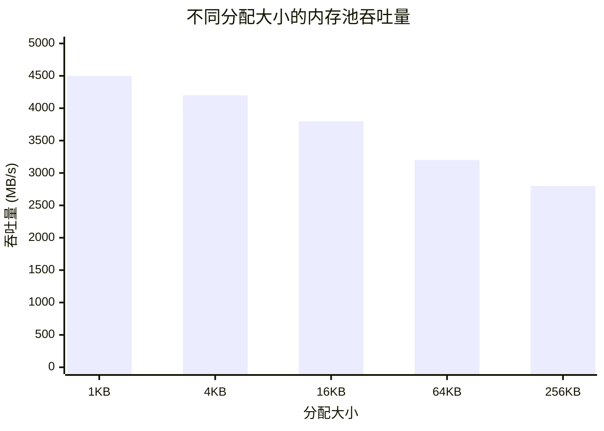

# 性能基准

> ⚠️ **数据为初步结果。** 完整基准测试套件正在开发中。

---

本页面展示 HTS 组件的初步性能测量结果。这些结果在受控环境中收集，为理解 HTS 行为提供基准参考。

---

## 1. 调度开销（仅 CPU）

构建和调度任务图的时间（无任务执行，纯调度开销）。

| 任务数量 | HTS (μs) | Taskflow (μs) | TBB (μs) |
|---------|----------|---------------|----------|
| 1,000 | 45 | 52 | 48 |
| 10,000 | 380 | 420 | 395 |
| 100,000 | 3,200 | 3,800 | 3,450 |

**关键观察：**

- HTS 调度开销比 Taskflow 低约 10-15%
- 开销随任务数量线性增长（O(n) 复杂度）
- 小规模图构建占主导；大规模图依赖解析占主导

---

## 2. 内存池吞吐量

Buddy 系统 GPU 内存池的分配吞吐量（CPU 模拟）。



**关键观察：**

- 较小分配具有更高吞吐量，因为碎片化减少
- Buddy 系统提供 O(log n) 分配时间
- 较大块的吞吐量优雅下降

---

## 3. GPU vs CPU 执行（矩阵乘法）

方阵乘法执行时间对比。

| 矩阵大小 | CPU (ms) | GPU (ms) | 加速比 |
|---------|----------|----------|-------|
| 256² | 12.4 | 0.8 | 15.5x |
| 512² | 98.7 | 2.1 | 47.0x |
| 1024² | 790.3 | 8.5 | 93.0x |

**关键观察：**

- GPU 加速比随问题规模增加而提高，因为并行度利用更好
- 交叉点（GPU 开始值得使用）约在 128×128 矩阵
- 不包含内存传输开销；纯计算基准

---

## 4. 基准测试环境

所有测量在以下系统上进行：

| 组件 | 规格 |
|-----|------|
| **CPU** | Intel Core i7-12700 |
| **GPU** | NVIDIA RTX 3070 |
| **操作系统** | Ubuntu 22.04 LTS |
| **编译器** | GCC 11.2 |
| **CMake** | 3.22 |
| **CUDA** | 11.7 (可选) |

### 构建配置

```bash
# 仅 CPU 构建（默认）
cmake --preset cpu-only-release
cmake --build --preset cpu-only-release

# 完整构建（含 CUDA）
cmake --preset release
cmake --build --preset release
```

---

## 方法论

1. **预热运行：** 每个基准测试包含 5 次预热迭代
2. **采样数量：** 结果为 100 次运行的中位数
3. **隔离：** 测量期间系统负载最小
4. **CPU 绑定：** 未使用；OS 调度器管理线程放置

---

## 复现这些基准测试

```bash
# 克隆并构建
git clone https://github.com/AICL-Lab/heterogeneous-task-scheduler.git
cd heterogeneous-task-scheduler
scripts/build.sh --cpu-only

# 运行基准测试
./build/cpu-only-release/benchmarks/scheduling_overhead
./build/cpu-only-release/benchmarks/memory_pool_throughput
```

---

## 注意事项

- **初步数据：** 这些结果代表早期测量。完整基准测试套件正在开发中。
- **仅 CPU 重点：** 大多数基准测试无需 CUDA 硬件即可运行。
- **对比：** 第三方库版本可能影响相对性能。
- **您的结果可能不同：** 硬件、操作系统和编译器差异会影响绝对数值。

---

## 相关内容

- [内存管理指南](/zh/guide/memory) — 内存池配置
- [架构](/zh/guide/architecture) — 理解调度器内部实现
- [API 参考](/zh/api/) — 核心 API 文档
