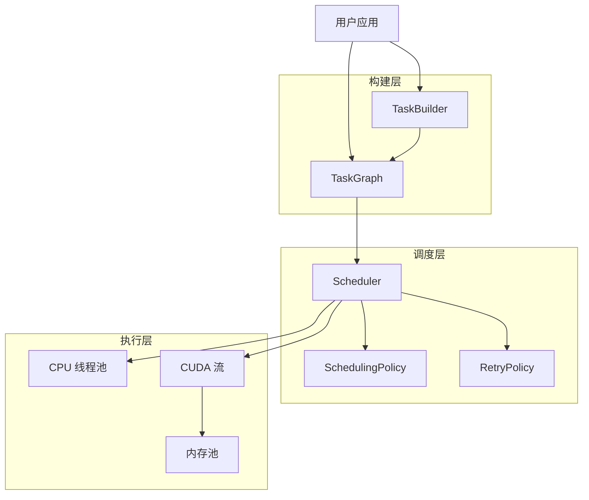

## 核心价值主张

> **"如果你会写函数，你就会写任务"** — 零学习成本的统一抽象

HTS 是一个 C++17 异构任务调度库，采用 DAG-First 架构设计。它允许你在同一个任务图中无缝混合 CPU 和 GPU 任务，自动处理依赖关系、内存管理和并发执行。

## 架构概览



## 学术基础

HTS 基于经典算法的工程实现：

| 算法 | 论文 | HTS 实现 |
|------|------|----------|
| **HEFT 调度** | Topcuoglu et al., 2002 | `include/hts/scheduling_policy.hpp` |
| **伙伴系统** | Knowlton, 1965 | `src/cuda/memory_pool.cu` |
| **拓扑排序** | Kahn, 1962 | `src/core/task_graph.cpp` |

::: info 学术引用
HTS 的调度算法基于 HEFT (Heterogeneous Earliest-Finish-Time) 算法，内存管理采用经典的 Buddy System 分配器。详见 [相关工作](/zh/research/related-work) 和 [学术论文引用](/zh/research/references)。
:::

## 框架对比

| 框架 | 语言 | GPU 支持 | DAG 支持 | 许可证 | 异构调度 |
|------|------|---------|---------|-------|---------|
| **HTS** | C++17 | CUDA | 原生 | MIT | ✅ HEFT+流感知 |
| StarPU | C | CUDA/OpenCL | 是 | LGPL | ✅ 成熟运行时 |
| Kokkos | C++ | CUDA/HIP | 否 | BSD | ❌ 编程模型 |
| HPX | C++ | 有限 | 是 | Boost | ⚠️ 实验性 |
| TBB | C++ | 否 | 是 | Apache | ❌ 仅 CPU |
| Taskflow | C++17 | 否 | 是 | MIT | ❌ 仅 CPU |

## 快速开始

::: code-group
```bash [克隆仓库]
git clone https://github.com/AICL-Lab/heterogeneous-task-scheduler.git
cd heterogeneous-task-scheduler
```

```bash [构建 (仅 CPU)]
scripts/build.sh --cpu-only
```

```bash [构建 (启用 CUDA)]
scripts/build.sh -DHTS_ENABLE_CUDA=ON
```

```bash [运行测试]
scripts/test.sh
```
:::

## 代码示例

```cpp
#include <hts/task_graph.hpp>
#include <hts/scheduler.hpp>

int main() {
    // 1. 创建任务图
    hts::TaskGraph graph;

    // 2. 添加任务
    auto load = graph.add_task("load_data", [] {
        // CPU 任务：加载数据
    });

    auto process = graph.add_task("process_gpu",
        [](hts::TaskContext& ctx, cudaStream_t stream) {
            // GPU 任务：CUDA 内核
        });

    auto save = graph.add_task("save_result", [] {
        // CPU 任务：保存结果
    });

    // 3. 声明依赖
    graph.add_dependency(load, process);
    graph.add_dependency(process, save);

    // 4. 执行
    hts::Scheduler scheduler;
    scheduler.execute(graph);

    return 0;
}
```

## 关键特性

| 特性 | 描述 |
|------|------|
| **C++17 原生** | 现代 C++，零开销抽象 |
| **DAG-First** | 依赖感知的任务调度 |
| **CPU + GPU** | 异构执行支持 |
| **内存池** | GPU 内存伙伴分配器 |
| **可插拔策略** | 自定义调度策略接口 |
| **性能分析** | 内置性能监控和时间线导出 |
