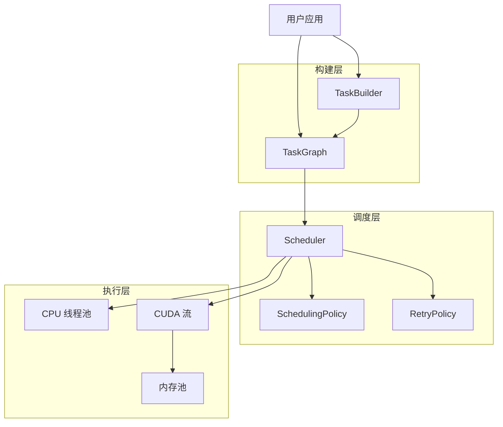

<script setup>
import { VPTeamMembers } from 'vitepress/theme'

const coreFeatures = [
  {
    avatar: '/heterogeneous-task-scheduler/logo.svg',
    name: 'DAG 优先执行',
    desc: '使用 TaskGraph 和 TaskBuilder 构建依赖感知的任务流水线。自动拓扑排序确保正确的执行顺序。',
    links: [
      { icon: 'github', link: '/zh/guide/architecture' }
    ]
  },
  {
    avatar: '/heterogeneous-task-scheduler/logo.svg',
    name: '异构计算',
    desc: '在同一任务图中无缝混合 CPU 和 GPU 任务。CUDA 流和内存池自动管理。',
    links: [
      { icon: 'github', link: '/zh/guide/scheduling' }
    ]
  },
  {
    avatar: '/heterogeneous-task-scheduler/logo.svg',
    name: '内存池',
    desc: 'GPU 内存池减少分配开销。伙伴系统分配器支持自动碎片整理。',
    links: [
      { icon: 'github', link: '/zh/guide/memory' }
    ]
  }
]
</script>

## 核心特性

<VPTeamMembers size="small" :members="coreFeatures" />

## 快速开始

::: code-group
```bash [克隆]
git clone https://github.com/LessUp/heterogeneous-task-scheduler.git
cd heterogeneous-task-scheduler
```

```bash [构建 (仅 CPU)]
scripts/build.sh --cpu-only
```

```bash [构建 (启用 CUDA)]
scripts/build.sh -DHTS_ENABLE_CUDA=ON
```
:::

## 架构概览



## 关键指标

| 特性 | 描述 |
|------|------|
| **C++17 原生** | 现代 C++，零开销抽象 |
| **DAG 优先** | 依赖感知的任务调度 |
| **CPU + GPU** | 异构执行支持 |
| **内存池** | GPU 内存伙伴分配器 |
| **性能分析** | 内置性能监控 |
