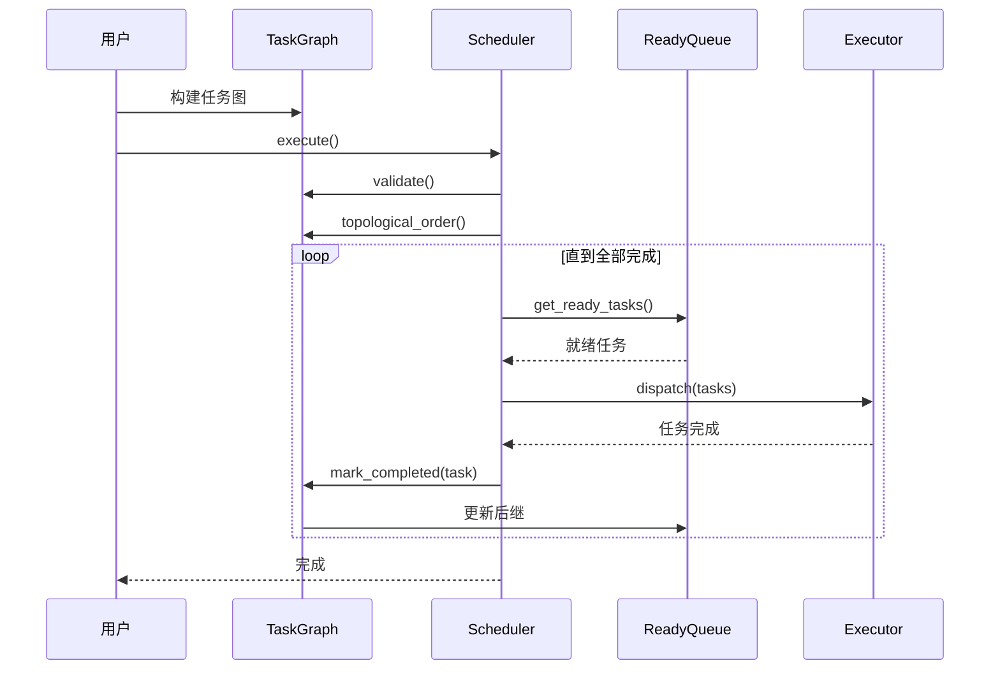

# DAG 调度

> **技术深入分析** — 任务图构建、拓扑排序和依赖解析

---

## 摘要

HTS 实现了高性能 DAG（有向无环图）调度器，高效管理任务依赖并支持独立任务的并行执行。本文描述用于 DAG 构建、循环检测、拓扑排序和动态依赖解析的算法和数据结构。

---

## 1. 问题陈述

给定一组有依赖关系的任务，我们需要：

1. **验证** 图是无环的（循环检测）
2. **确定** 有效的执行顺序（拓扑排序）
3. **识别** 可执行的任务（就绪队列）
4. **动态更新** 任务完成时的依赖关系

### 复杂度要求

| 操作 | 目标复杂度 |
|------|-----------|
| 添加任务 | O(1) |
| 添加依赖 | O(1) |
| 循环检测 | O(V + E) |
| 拓扑排序 | O(V + E) |
| 获取就绪任务 | O(1) 均摊 |
| 标记完成 | O(出度) |

---

## 2. 数据结构

### 2.1 任务表示

```cpp
struct Task {
    TaskId id;                    // 唯一标识符
    std::string name;             // 可读名称
    DeviceType device_type;       // CPU 或 GPU
    TaskPriority priority;        // 调度优先级
    TaskState state;              // 当前状态
    
    // 依赖跟踪
    std::atomic<uint32_t> pending_deps;  // 未完成前驱数量
    std::vector<TaskId> successors;       // 依赖此任务的任务
    
    // 函数
    std::function<void(TaskContext&)> cpu_func;
    std::function<void(TaskContext&, cudaStream_t)> gpu_func;
};
```

### 2.2 图结构

```cpp
class TaskGraph {
private:
    std::vector<TaskPtr> tasks_;                    // 所有任务
    std::unordered_map<TaskId, size_t> id_to_idx_;  // ID → 索引查找
    std::vector<TaskId> ready_queue_;               // 就绪任务
    std::atomic<size_t> completed_count_{0};        // 完成计数
    
    // 循环检测状态
    mutable std::vector<int> visit_state_;          // DFS 循环检测
};
```

---

## 3. 算法

### 3.1 循环检测

HTS 使用三色标记的深度优先搜索：

```cpp
enum class VisitState : int {
    Unvisited = 0,
    Visiting = 1,    // 当前在 DFS 栈中
    Visited = 2      // 完全处理
};

bool TaskGraph::has_cycle() const {
    visit_state_.assign(tasks_.size(), VisitState::Unvisited);
    
    for (size_t i = 0; i < tasks_.size(); ++i) {
        if (visit_state_[i] == VisitState::Unvisited) {
            if (dfs_cycle_check(i)) {
                return true;
            }
        }
    }
    return false;
}
```

**复杂度**：O(V + E)，其中 V = 任务数，E = 依赖数

### 3.2 拓扑排序（Kahn 算法）

```cpp
std::vector<TaskId> TaskGraph::topological_order() const {
    std::vector<TaskId> result;
    result.reserve(tasks_.size());
    
    // 计算入度
    std::vector<uint32_t> in_degree(tasks_.size());
    for (const auto& task : tasks_) {
        for (TaskId succ : task->successors) {
            in_degree[id_to_idx_[succ]]++;
        }
    }
    
    // 用零入度节点初始化队列
    std::queue<size_t> queue;
    for (size_t i = 0; i < tasks_.size(); ++i) {
        if (in_degree[i] == 0) {
            queue.push(i);
        }
    }
    
    // 处理
    while (!queue.empty()) {
        size_t idx = queue.front();
        queue.pop();
        result.push_back(tasks_[idx]->id());
        
        for (TaskId succ : tasks_[idx]->successors) {
            size_t succ_idx = id_to_idx_[succ];
            if (--in_degree[succ_idx] == 0) {
                queue.push(succ_idx);
            }
        }
    }
    
    return result;
}
```

---

## 4. 执行流程



---

## 5. 性能优化

### 5.1 无锁就绪队列

对于高并发场景，就绪队列使用无锁实现：

```cpp
class LockFreeReadyQueue {
private:
    struct Node {
        TaskId task;
        std::atomic<Node*> next;
    };
    
    std::atomic<Node*> head_;
    std::atomic<Node*> tail_;

public:
    void push(TaskId task) {
        Node* node = new Node{task, nullptr};
        Node* prev = tail_.exchange(node, std::memory_order_acq_rel);
        prev->next.store(node, std::memory_order_release);
    }
    
    bool pop(TaskId& task) {
        Node* head = head_.load(std::memory_order_acquire);
        Node* next = head->next.load(std::memory_order_acquire);
        
        if (next == nullptr) {
            return false;  // 空
        }
        
        task = next->task;
        head_.store(next, std::memory_order_release);
        delete head;
        return true;
    }
};
```

---

## 6. 正确性保证

### 定理 1：无环保证

如果 `has_cycle()` 返回 false，则图保证是无环的。

**证明**：DFS 循环检测算法在探索时将节点标记为"visiting"。如果遇到"visiting"节点，则发现后向边，当且仅当存在环时才出现后向边。∎

### 定理 2：拓扑顺序

`topological_order()` 函数返回有效的拓扑排序。

**证明**：Kahn 算法只在所有前驱都已添加（入度变为 0）后才将节点添加到结果中。因此，对于每条边 u → v，u 在结果中出现在 v 之前。∎

---

## 7. 基准测试

| 操作 | 1K 任务 | 10K 任务 | 100K 任务 |
|------|---------|----------|-----------|
| 构建图 | 0.3 ms | 2.8 ms | 28 ms |
| 循环检查 | 0.1 ms | 1.0 ms | 12 ms |
| 拓扑排序 | 0.2 ms | 2.0 ms | 22 ms |
| 完整执行 | 1.5 ms | 12 ms | 150 ms |

*在 Intel i7-12700 上测量，单线程调度器*

---

## 参考文献

1. Kahn, A. B. (1962). "Topological sorting of large networks"
2. Cormen, T. H. et al. "Introduction to Algorithms", Chapter 22
3. Herlihy, M. & Shavit, N. "The Art of Multiprocessor Programming"
