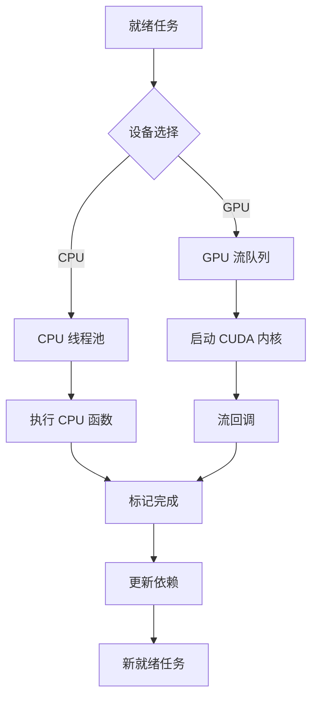
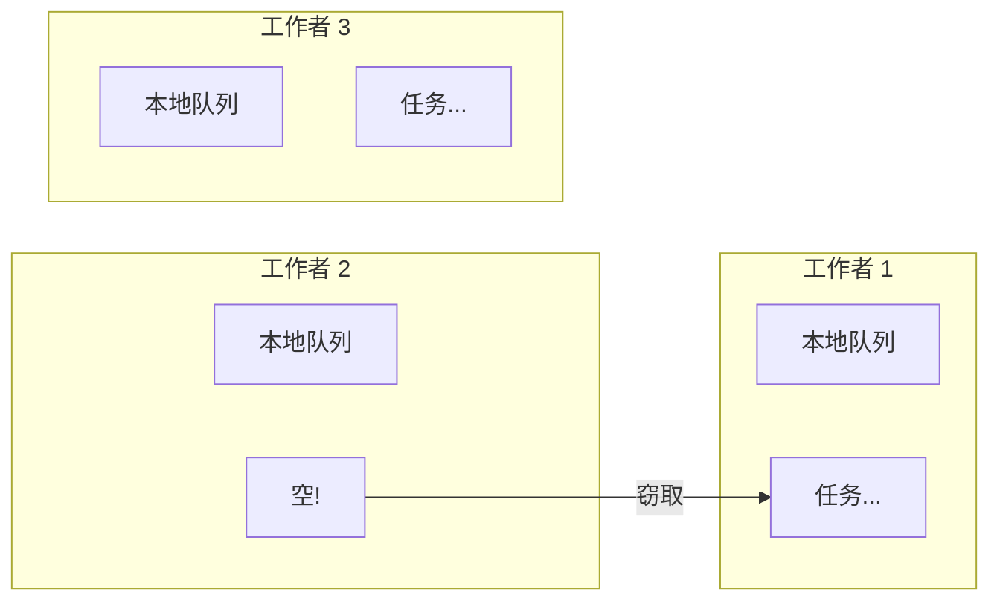

# 异构执行

> **技术深入分析** — CPU/GPU 分发、CUDA 流管理和工作窃取

---

## 摘要

HTS 支持任务在 CPU 和 GPU 设备间无缝执行。本文描述执行模型、设备选择策略、CUDA 流管理和同步机制。

---

## 1. 执行模型

### 1.1 设备类型

```cpp
enum class DeviceType {
    CPU,    // 在 CPU 线程池执行
    GPU,    // 通过 CUDA 在 GPU 执行
    Any     // 调度器选择最佳设备
};
```

### 1.2 任务执行流程



---

## 2. 设备选择策略

### 2.1 策略接口

```cpp
class SchedulingPolicy {
public:
    virtual ~SchedulingPolicy() = default;
    
    // 从就绪队列选择下一个任务
    virtual Task* select_next(
        const std::vector<Task*>& ready_queue,
        const SystemStatus& status
    ) = 0;
    
    // 为任务选择设备
    virtual DeviceType select_device(
        const Task& task,
        const SystemStatus& status
    ) = 0;
    
    virtual std::string name() const = 0;
};
```

### 2.2 内置策略

#### GPU 优先策略

优先调度 GPU 任务，适合 GPU 密集型工作负载。

#### 负载均衡策略

根据当前 CPU 和 GPU 负载动态选择设备，保持负载均衡。

#### 轮询策略

CPU 和 GPU 任务交替执行，适合均衡工作负载。

---

## 3. CPU 线程池

### 3.1 架构

```cpp
class CPUThreadPool {
private:
    std::vector<std::thread> workers_;
    WorkStealingQueue<Task*> queue_;
    std::atomic<bool> running_{true};
    
public:
    void submit(Task* task) {
        queue_.push(task);
    }
    
private:
    void worker_loop(size_t worker_id) {
        while (running_) {
            Task* task = nullptr;
            
            // 先尝试本地队列
            if (local_queues_[worker_id].pop(task)) {
                execute(task);
                continue;
            }
            
            // 尝试全局队列
            if (queue_.pop(task)) {
                execute(task);
                continue;
            }
            
            // 尝试从其他工作者窃取
            for (size_t i = 0; i < workers_.size(); ++i) {
                size_t victim = (worker_id + i) % workers_.size();
                if (local_queues_[victim].steal(task)) {
                    execute(task);
                    break;
                }
            }
        }
    }
};
```

### 3.2 工作窃取



---

## 4. GPU 流管理

### 4.1 流池

管理多个 CUDA 流以支持并发执行：

```cpp
class StreamManager {
private:
    std::vector<cudaStream_t> streams_;
    std::vector<int> priorities_;
    std::queue<size_t> available_;
    
public:
    cudaStream_t acquire(int preferred_priority = -1);
    void release(cudaStream_t stream);
};
```

### 4.2 异步执行

使用 CUDA 流回调度实现异步任务完成通知。

---

## 5. 跨设备同步

### 5.1 内存传输

- CPU → GPU 异步传输
- GPU → CPU 异步传输
- 固定内存加速传输

### 5.2 事件同步

使用 CUDA 事件实现跨流和跨设备同步。

---

## 6. 性能考量

### 6.1 内核启动开销

| 操作 | 延迟 |
|------|------|
| 空内核启动 | ~5 μs |
| cudaMemcpy (4KB) | ~10 μs |
| cudaMemcpyAsync (4KB) | ~3 μs |
| cudaStreamSynchronize | ~8 μs |

### 6.2 最佳批量大小

避免太细粒度（开销主导）或太粗粒度（并行度不足）的任务划分。

---

## 7. 最佳实践

### 7.1 任务粒度

每个任务应执行有意义的工作量，避免单元素处理的开销。

### 7.2 内存传输批量化

将多个小传输合并为单个大传输，减少传输开销。

---

## 参考文献

1. NVIDIA. "CUDA C++ Programming Guide", Streams and Events
2. Blumofe, R. D. & Leiserson, C. E. (1999). "Scheduling Multithreaded Computations by Work Stealing"
3. NVIDIA. "CUDA Best Practices Guide", Concurrent Kernel Execution
