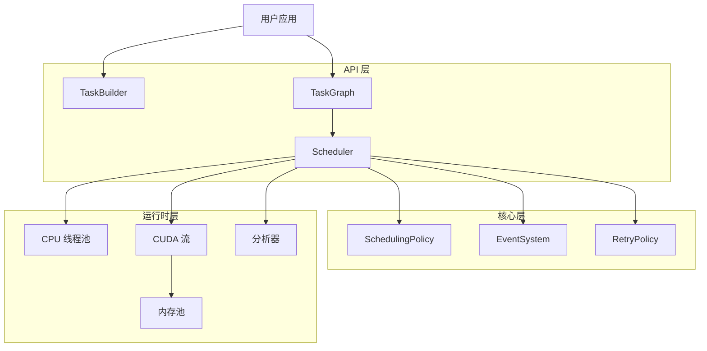

# 技术白皮书

> **HTS 架构深入分析** — 异构任务调度器的全面技术分析

---

## 概述

本白皮书章节为 HTS 提供深入的技术文档，涵盖核心算法、数据结构和设计决策，这些使得高效的异构计算成为可能。

## 论文

### 1. [DAG 调度](/zh/whitepaper/dag-scheduling)

**主题**：任务图构建、拓扑排序、循环检测、依赖解析

**核心概念**：
- Kahn 算法实现拓扑排序
- 无锁就绪队列实现
- 增量依赖跟踪

### 2. [内存管理](/zh/whitepaper/memory-management)

**主题**：GPU 内存池、伙伴分配器、碎片整理策略

**核心概念**：
- 伙伴系统分配器设计
- 内存池生命周期
- 分配开销分析

### 3. [异构执行](/zh/whitepaper/heterogeneous-execution)

**主题**：CPU/GPU 分发、CUDA 流管理、工作窃取

**核心概念**：
- 设备选择策略
- 流优先级管理
- 跨设备同步

### 4. [性能分析](/zh/whitepaper/performance-analysis)

**主题**：性能分析基础设施、优化策略、基准测试方法

**核心概念**：
- 时间线导出（Chrome 追踪格式）
- 关键路径分析
- 可扩展性考量

---

## 架构概览

---

## 设计原则

### 1. 零开销抽象

HTS 遵循 C++ 的"不为你不使用的功能付费"原则：

- 热路径中无虚函数调用（不使用多态特性时）
- 尽可能使用编译时设备类型选择
- 简单操作使用内联函数
- 类型安全使用模板元编程

### 2. 尽可能无锁

关键路径使用无锁数据结构：

- 状态更新使用原子操作
- 就绪任务使用无锁队列
- 状态转换使用比较交换

### 3. 错误弹性

- 全面的错误码（见 `types.hpp`）
- 瞬态故障的重试策略
- 错误时优雅降级
- 带上下文的详细错误信息

---

## 目标读者

本白皮书面向：

- **库开发者** 扩展 HTS 功能
- **性能工程师** 优化 HTS 部署
- **研究人员** 研究任务调度算法
- **贡献者** 参与 HTS 代码库

---

## 前置知识

- C++17 熟练
- DAG 数据结构理解
- 基础 CUDA 编程知识（GPU 章节）
- 并发编程模式熟悉

---

## 相关文档

- [架构指南](/zh/guide/architecture) — 高层系统概览
- [API 参考](/zh/api/) — 完整 API 文档
- [性能基准](/zh/benchmarks/) — 性能测量
