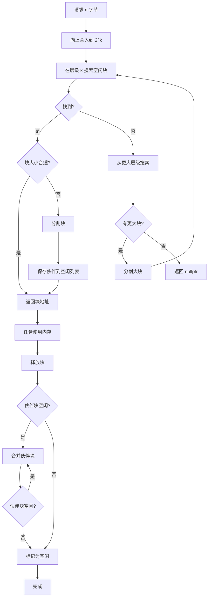
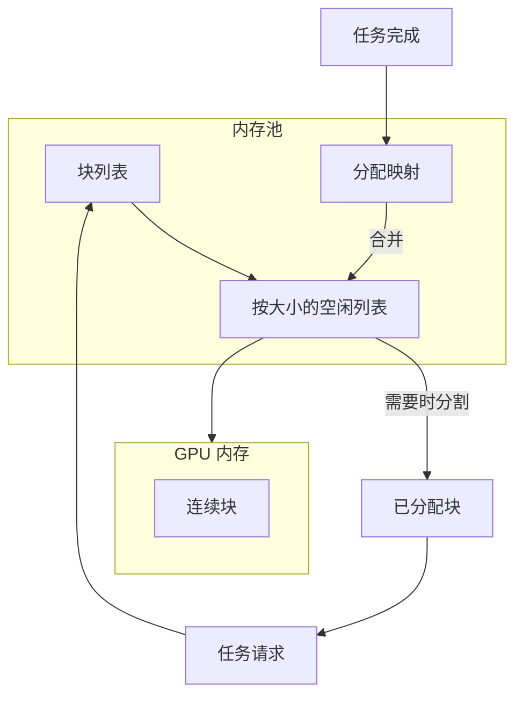

# 内存管理

> **技术深入分析** — GPU 内存池、伙伴分配器和碎片整理策略

---

## 摘要

HTS 使用伙伴系统分配算法实现高性能 GPU 内存池。本文描述内存管理子系统的设计、实现和性能特征。

---

## 1. 动机

### 1.1 cudaMalloc 的问题

直接 GPU 内存分配有显著开销：

```cpp
// 朴素方法 - 慢
void process() {
    void* d_data;
    cudaMalloc(&d_data, size);  // 每次调用约 10-50 μs
    // ... 使用内存 ...
    cudaFree(d_data);           // 每次调用约 5-20 μs
}
```

对于有许多小分配的应用，此开销占主导地位。

### 1.2 目标

1. **降低分配延迟** 从微秒到纳秒
2. **最小化碎片** 通过智能合并
3. **高效支持变长分配**
4. **线程安全** 并发分配

---

## 2. 伙伴系统分配器

### 2.1 概念

伙伴系统将内存划分为 2 的幂次大小的块。当块被释放时，可以与其"伙伴"（相同大小的相邻块）合并形成更大的块。

```
初始: [____________________64KB____________________]

分配 16KB 后:
[________16KB________][______________32KB____________]

再分配 8KB:
[________16KB________][____8KB____][______16KB______]

释放 16KB:
[________16KB________][____8KB____][______16KB______]
         ↓
[____________________24KB________________][__16KB__]  (合并)
```

### 2.2 分配流程



### 2.3 数据结构

```cpp
class BuddyAllocator {
private:
    void* base_ptr_;              // 池基地址
    size_t total_size_;           // 总池大小
    size_t min_block_size_;       // 最小分配（通常 256 字节）
    int max_order_;               // log2(max_block_size / min_block_size)
    
    // 空闲列表：每个大小类一个
    std::array<std::vector<Block*>, MAX_ORDER> free_lists_;
    
    // 已分配块跟踪
    std::unordered_map<void*, BlockInfo> allocated_;
    
    // 同步
    std::mutex mutex_;
};
```

### 2.3 分配算法

```cpp
void* BuddyAllocator::allocate(size_t size) {
    // 向上取整到 2 的幂
    size = next_power_of_two(size);
    int order = log2(size / min_block_size_);
    
    std::lock_guard<std::mutex> lock(mutex_);
    
    // 查找适合的最小空闲块
    for (int o = order; o <= max_order_; ++o) {
        if (!free_lists_[o].empty()) {
            Block* block = free_lists_[o].back();
            free_lists_[o].pop_back();
            
            // 必要时分割更大的块
            while (o > order) {
                o--;
                Block* buddy = split_block(block, o);
                free_lists_[o].push_back(buddy);
            }
            
            allocated_[block] = {order, false, get_buddy(block, order)};
            return block;
        }
    }
    
    return nullptr;  // 内存不足
}
```

---

## 3. 内存池架构



---

## 4. 碎片整理

### 4.1 碎片指标

```cpp
struct FragmentationMetrics {
    double external_fragmentation;  // 1 - (最大空闲 / 总空闲)
    double internal_fragmentation;  // 已分配块内的浪费空间
    size_t free_block_count;
    size_t largest_free_block;
};
```

### 4.2 自动碎片整理

当碎片超过阈值时自动触发整理操作，包括：
1. 识别可移动块
2. 分配新的连续区域
3. 异步复制数据
4. 更新指针
5. 重置分配器

---

## 5. 性能分析

### 5.1 分配延迟

| 分配大小 | cudaMalloc | 伙伴分配器 | 加速比 |
|---------|------------|-----------|--------|
| 256 字节 | 12 μs | 0.3 μs | 40x |
| 4 KB | 15 μs | 0.4 μs | 37x |
| 64 KB | 18 μs | 0.5 μs | 36x |
| 1 MB | 25 μs | 0.6 μs | 42x |
| 16 MB | 45 μs | 0.8 μs | 56x |

### 5.2 内存开销

| 池大小 | 元数据开销 | 碎片损失 |
|--------|-----------|---------|
| 256 MB | 0.5 MB (0.2%) | < 5% 典型 |
| 1 GB | 2 MB (0.2%) | < 5% 典型 |

---

## 6. 最佳实践

### 6.1 池大小配置

```cpp
// 已知工作负载
size_t estimated_peak = calculate_peak_memory(tasks);
pool_config.initial_size = estimated_peak * 1.2;  // 20% 余量

// 未知工作负载
pool_config.initial_size = 256 * 1024 * 1024;  // 从小开始
pool_config.allow_growth = true;
pool_config.max_size = 4 * 1024 * 1024 * 1024;  // 上限 4GB
```

### 6.2 分配模式

```cpp
// 推荐：相似大小，适合伙伴系统
for (int i = 0; i < n; ++i) {
    void* buf = pool.allocate(1024 * 1024);  // 全部 1MB
    pool.deallocate(buf);
}

// 避免：大量小分配
for (int i = 0; i < 10000; ++i) {
    void* buf = pool.allocate(100);  // 太小，浪费伙伴块
    pool.deallocate(buf);
}

// 更好：批量小分配
void* batch = pool.allocate(100 * 10000);  // 一次大分配
// 使用偏移量
```

---

## 参考文献

1. Knowlton, K. C. (1965). "A Fast Storage Allocator"
2. Knuth, D. E. "The Art of Computer Programming, Vol 1", Section 2.5
3. NVIDIA. "CUDA C++ Best Practices Guide", Memory Optimization
