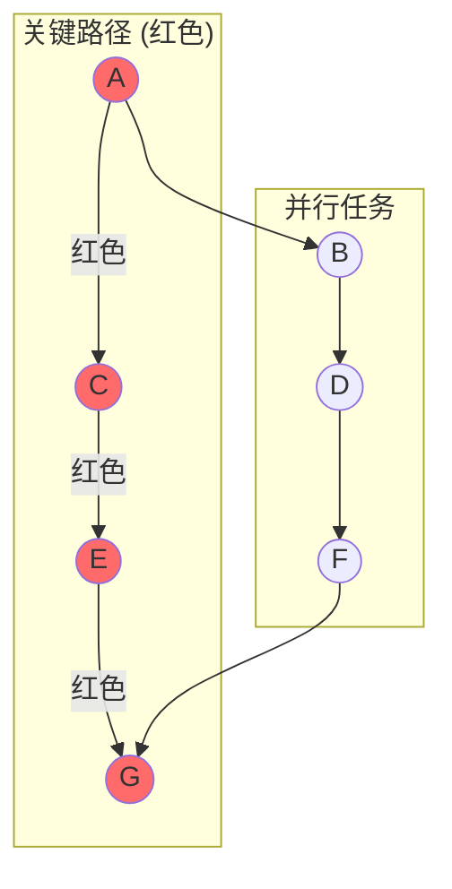

# 性能分析

> **技术深入分析** — 性能分析基础设施、优化策略和基准测试方法

---

## 摘要

HTS 包含全面的性能分析基础设施，用于理解调度器行为和识别性能瓶颈。本文描述分析架构、分析技术和优化策略。

---

## 1. 分析架构

### 1.1 数据收集

```cpp
class Profiler {
private:
    struct TaskRecord {
        TaskId id;
        std::string name;
        DeviceType device;
        TaskPriority priority;
        
        // 时间
        std::chrono::nanoseconds created_time;
        std::chrono::nanoseconds started_time;
        std::chrono::nanoseconds completed_time;
        
        // 依赖
        std::vector<TaskId> predecessors;
        std::vector<TaskId> successors;
    };
    
    std::vector<TaskRecord> records_;
};
```

### 1.2 计算指标

| 指标 | 公式 | 解释 |
|------|------|------|
| **任务时间** | `完成 - 开始` | 实际执行时间 |
| **等待时间** | `开始 - 创建` | 等待依赖的时间 |
| **关键路径** | DAG 中最长路径 | 执行时间下界 |
| **并行度** | `Σ(任务时间) / 墙钟时间` | 平均并发任务数 |
| **CPU 利用率** | `cpu任务时间 / (墙钟时间 × 线程数)` | CPU 效率 |
| **GPU 利用率** | `gpu任务时间 / (墙钟时间 × 流数)` | GPU 效率 |

---

## 2. 时间线导出

### 2.1 Chrome 追踪格式

HTS 导出与 Chrome `about:tracing` 查看器兼容的时间线：

```json
{
  "traceEvents": [
    {"name": "TaskA", "cat": "CPU", "ph": "B", "ts": 1000, "pid": 1, "tid": 1},
    {"name": "TaskA", "cat": "CPU", "ph": "E", "ts": 2500, "pid": 1, "tid": 1}
  ]
}
```

### 2.2 时间线可视化

```
时间线视图 (Chrome Tracing):
┌────────────────────────────────────────────────────────────┐
│ CPU 线程 1  │████████│      │████████████│                │
│ CPU 线程 2  │        │██████│            │████████████│    │
│ GPU 流 0    │        │████████████████████│            │    │
│ GPU 流 1    │        │                  │████████████│    │
└────────────────────────────────────────────────────────────┘
               0ms     10ms   20ms         40ms         60ms
```

---

## 3. 关键路径分析

### 3.1 算法

计算每个任务的最早完成时间，然后回溯找出关键路径上的任务。

### 3.2 优化洞察

**洞察**：优化非关键路径上的任务不会减少总时间。应专注于关键路径上的任务。



---

## 4. 瓶颈检测

### 4.1 设备负载不均衡

分析 CPU 和 GPU 的空闲比例，给出优化建议。

### 4.2 依赖热点

找出阻塞最多任务的关键节点。

---

## 5. 优化策略

### 5.1 任务图重构

通过调整依赖关系增加并行度。

### 5.2 设备选择调优

分析任务特性，建议更适合的设备选择。

### 5.3 内存传输优化

识别可批量化的小传输，建议使用固定内存。

---

## 6. 基准测试方法

### 6.1 受控环境

```cpp
struct BenchmarkConfig {
    int warmup_iterations = 5;
    int measurement_iterations = 100;
    bool pin_to_cpu = true;
    std::vector<int> cpu_affinity;
};
```

### 6.2 统计分析

计算均值、中位数、标准差、最小值、最大值和百分位数。

---

## 7. 结果解读

### 7.1 良好并行度

```
任务数: 100
墙钟时间: 100 ms
总任务时间: 800 ms
并行度: 800 / 100 = 8.0x

解释: 良好 - 平均 8 个任务并发执行
```

### 7.2 较差并行度

```
任务数: 100
墙钟时间: 800 ms
总任务时间: 850 ms
并行度: 850 / 800 = 1.06x

解释: 较差 - 接近顺序执行
建议: 检查依赖图，启用更多并行
```

---

## 参考文献

1. Abramson, D. et al. "Performance Analysis and Visualization"
2. NVIDIA Nsight Systems Documentation
3. Chrome Tracing Format Specification
